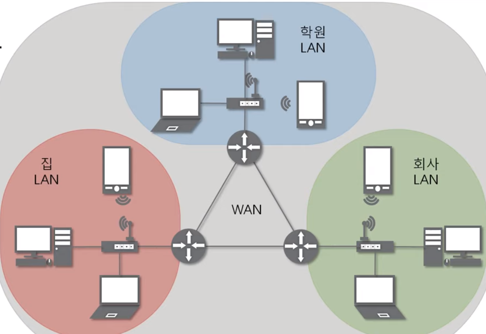
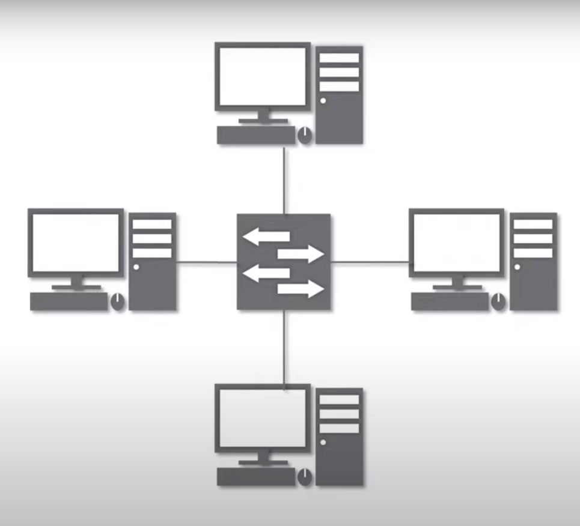
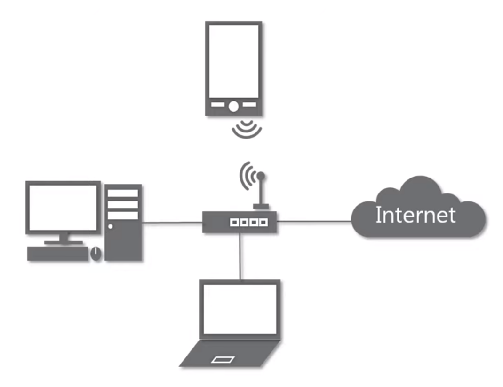
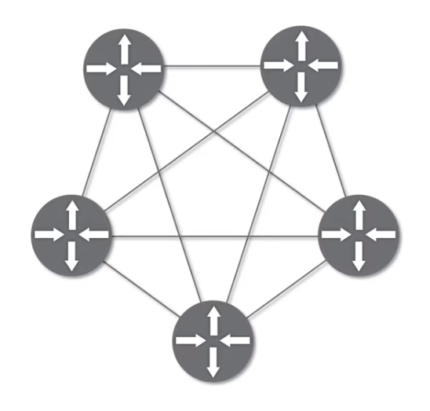
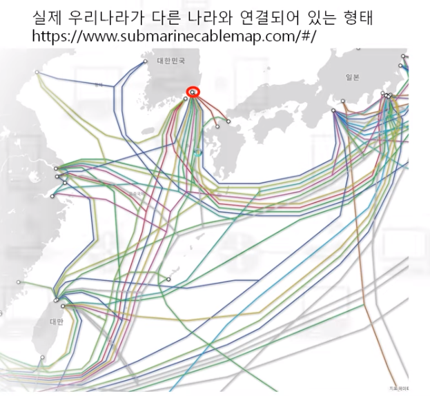
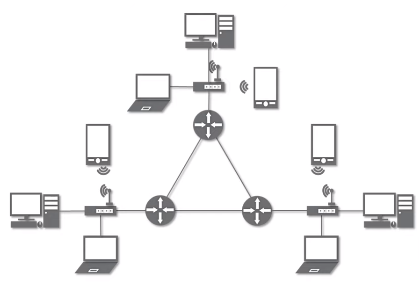
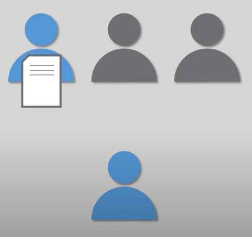
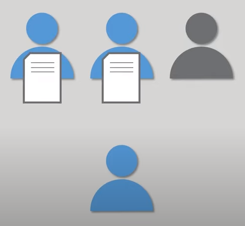
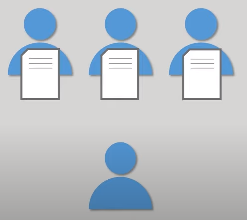
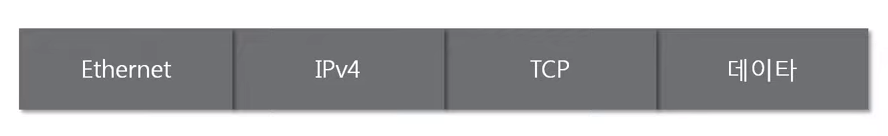

**목차**

- 네트워크란 무엇인가?

- 네트워크의 분류

- 네트워크의 통신 방식

- 네트워크 프로토콜

- 실습

## 1. 네트워크란 무엇인가?

**네트워크**

- 분산되어 있는 컴퓨터를 통신망으로 연결한 것
- 네트워크에서 여러 장치들은 노드 간 연결을 사용하여 서로에게 데이터를 교환

**인터넷**

- 웹, 게임 등 문서, 그림, 영상과 같은 여러가지 데이터를 공유하도로 구성된 세상에서 가장 큰 전세계를 연결하는 네트워크
- 네트워크 안에 인터넷이 포함된 것
- www
  - 인터넷 (x)  
  - 인터넷을 통해 웹과 관련된 데이터를 공유하는 것 (o)

## 2. 네트워크의 분류

**크기에 따른 분류**

- LAN
  - Local Area Network
  - 가까운 지역을 하나로 묶은 네트워크
  - 같은 피시방에서 LAN UDP 이용하여 친구와 스타
- WAN
  - Wide Area Network
  - 멀리 있는 지역을 한데 묶은 네트워크
  - 여러 개의 LAN을 서로 연결

**연결 형태에 따른 분류**

- Star 형

  - 중앙 장비에 모든 노드가 연결

  - 하나의 LAN 대역 Star형 많이 이용

  - ex. 공유기

    

    

- Mesh 형

  - 여러 노드들이 서로 그물처럼 연결
  - 하나가 고장나면 다른 길로 가면 됨

  

- 혼합형
  - 실제 인터넷은 여러 형태를 혼합한 형태

## 4. 네트워크의 통신방식

**데이터 주고 받는 방식**

- 유니 캐스트

  - 특정 대상이랑만 1:1로 통신

  

- 멀티 캐스트

  - 특정 다수와 1:N으로 통신

  

- 브로드 캐스트

  - 네트워크에 있는 모든 대상과 통신

그렇다면 네트워크에 있는 특정한 사용자를 어떻게 찾아낼까?

## 5. 네트워크 프로토콜

**프로토콜**

- 일종의 약속, 양식
- 네트워크에서 노드와 노드가 통신할 때 어떤 노드가 어느 노드에게 어떤 데이터를 어떻게 보내는지 작성하기 위한 양식
- 각 프로토콜도 해당 프로토콜만의 양식이 있다. like 택배 양식, 전화 양식, 편지 양식

**여러가지 프로토콜**

- 가까운 곳과 연락
  - Ethernet 프로토콜 - MAC 주소
- 멀리 있는 곳과 연락
  - ICMP, IPv4, ARP - IP 주소
- 여러가지(특정) 프로그램으로 연락
  - TCP, UDP - 포트 번호

**패킷**

- 여러 개의 프로토콜 같이 사용. 캡슐화 됨. 

