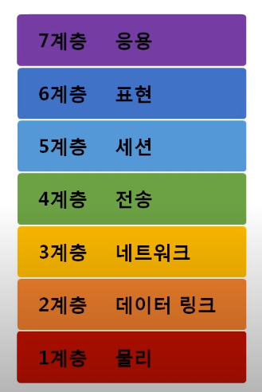

**목차**

- 네트워크 모델의 종류
- 두 모델 비교
- 네트워크를 통해 전달되는 데이터, 패킷
- 실습

## 1. 네트워크 모델의 종류

**TCP/IP 모델**

- 얘가 먼저 나옴
- 1960년대 말 연구 시작 후 1980년대 초 프로토콜 모델로 공개
- 현재의 인터넷에서 컴퓨터들이 서로 정보를 주고받는데 쓰이는 통신 규약(프로토콜)의 모음
- 실질적으로 네트워크 패킷들을 살펴보면 이 경우가 더 많다

**OSI 7계층**

- 얘가 더 중요
- 네트워크 통신을 체계적으로 다루는 ISO에서 표준으로 지정한 모델
- 데이터를 주고 받을 때 데이터 자체의 흐름을 각 구간별로 나눠 놓은 것

**OSI 7계층 모델의 계층별 프로토콜**

## 2. 두 모델 비교

**공통점**

- 계층적 네트워크 모델
- 계층간 역할 정의 

**차이점**

- 계층의 수 차이

- OSI 논리적으로 역할만 나눠 놓은 것
- TCP/IP 모델은 네트워크를 통해서 데이터를 전달하는 기술 자체, 실무
- OSI는 역할 기반, TCP/IP는 프로토콜 기반
- 단, 면접에서는 OSI 많이 물어본다.

### 3. 네트워크를 통해 전달되는 데이터, 패킷

**패킷**

- 네트워크에서 전달하는 데이터의 형식화된 블록
- 제어 정보와 사용자 데이터로 이루어지며 사용자 데이터는 페이로드라고 한다.
  - 누가 누구에게 보내는지
  - 어떻게 어떤 데이터를
  - 무엇을 요청하는지, 보내주는지
- 패킷 프로토콜에 순서가 있다

- 헤더 - 페이로드 - 풋터

- 페이로드: 실질적으로 보내려는 데이터

- 풋터: 잘 사용안함.

- HTTP 프로토콜을 페이로드로 해서 TCP라고 하는 헤더를 붙인 것. 다시 저 두 패킷을 페이로드로 해서 IPv4를 헤더로 붙인 것. 다시 저 세 패킷을 페이로드로 해서 Ethernet을 헤더로 붙인 것.

**캡슐화** **Encapsulation**

- 페이로드에 프로토콜을 헤더로 붙이는 과정

- 일반적으로 내가 누군가에게 패킷을 보낼 때 사용

- 여러 프로토콜을 이용해서 최종적으로 보낼 때 패킷을 만드는 과정

  

- 마음의 소리 몇 화가 보고 싶어~ - 요청 데이터
- 네이버의 웹 서버와 통신해야 하므로 TCP라는 헤더 인캡슐레이션
- 멀리 가야 되니까 TCP와 데이터를 IPv4라는 헤더로 인캡슐레이션
- 일단 가까운 곳이랑 통신해야 되니까 Ethernet을 헤더로 인캡슐레이션
- TCP: 4계층, IPv4: 3계층, Ethernet: 2계층. OSI 7 layer 상위계층에서 하위계층으로 붙음

**디캡슐화** **Decapsulation**

- 패킷을 받았을 때 프로토콜들을 하나씩 확인하면서 데이터를 확인하는 과정
- 하위 프로토콜부터 하나씩 까보면서 누가 나한테 보냈는지 확인

- 여러 프로토콜을 이용해서 최종적으로 받을 때 패킷을 만드는 과정

**계층별 패킷의 이름 PDU, Protocol Data Unit**

