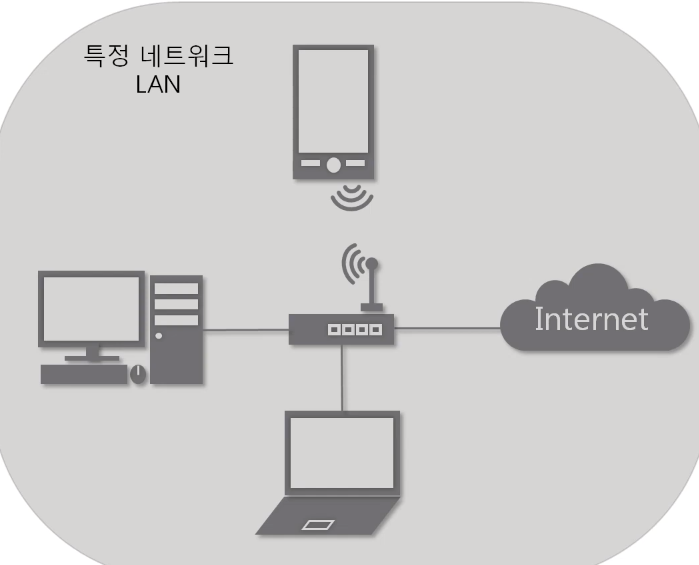
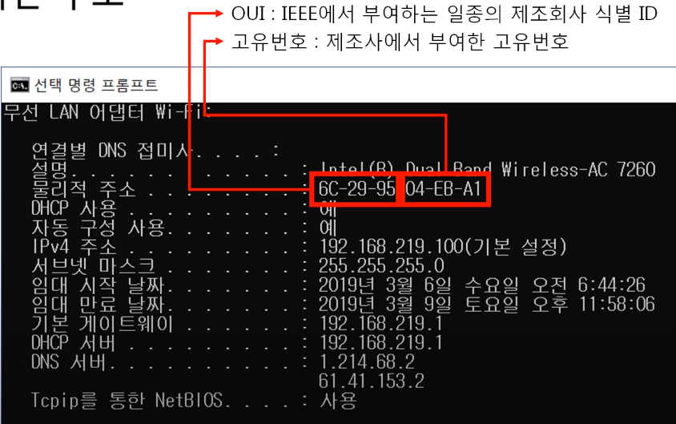
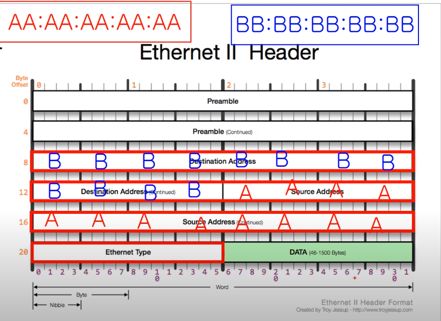

**목차**

- 2계층에서 하는 일
- 2계층에서 사용하는 주소
- 2계층 프로토콜

## 1. 2계층에서 하는 일

**2계층의 기능**

2계층은 하나의 네트워크 대역, 즉 같은 네트워크 상에 존재하는 여러 장비들 통신

- 오류제어
  - 데이터에 오류가 있는지 없는지 체크
- 흐름제어
  - 어떤 장비가 어떤 장비에게 보내는 데이터를 전달

**2계층의 네트워크 크기**

- 하나의 네트워크 대역 LAN에서만 통신할 때 사용
- 다른 네트워크와 통신할 때는 항상 3계층이 도와주어야 함
  - 3계층의 주소와 3계층의 프로토콜을 이용하여야만 다른 네트워크와 통신 가능

## 2. 2계층에서 사용하는 주소

**MAC 주소**

- 물리적인 주소
- LAN에서 통신할 때 사용
- 하드웨어 장치에 직접적으로 부여되는 값
- 전세계 모든 장비들이 서로 다른 주소 가지고 있음 
- 16진수 12자리
- 16진수 2개당 1바이트 => MAC주소는 6바이트

## 3. 2계층 프로토콜

**Ethernet 프로토콜**

- LAN에서 통신할 때 사용
- Preamble: 비트 동기 또는 프레임 동기 등을 위하여 프레임 단위 별로, 각 프레임의 맨 앞에 붙이는 영역

이더넷 프로토콜(14바이트)

- Destination Address: 목적지 MAC 주소. 6바이트

- Source Address: 출발지 MAC 주소. 6바이트

- Ethernet Type: 상위 프로토콜(DATA)이 무잇인지 알려줌. 2바이트

  - IPV4: 0 8 0 0 (0x0800)
  - ARP: 0 8 0 6 (0x0806)

  

- DATA: 페이로드
