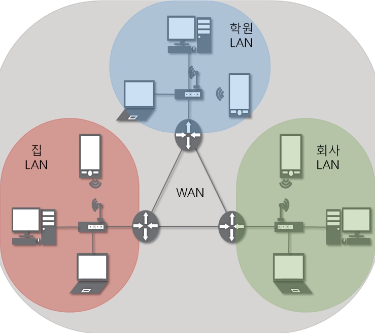
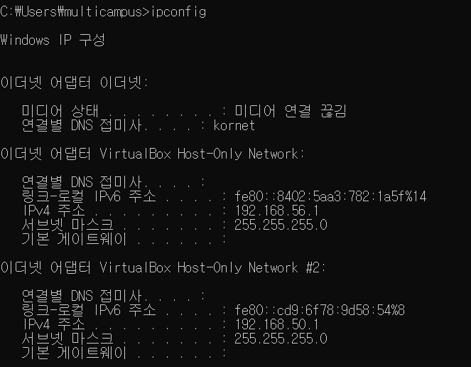
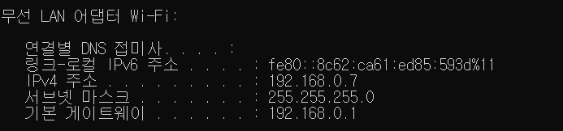
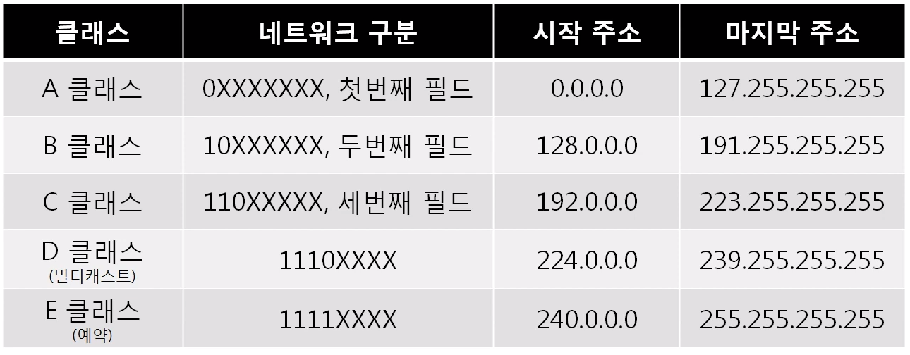
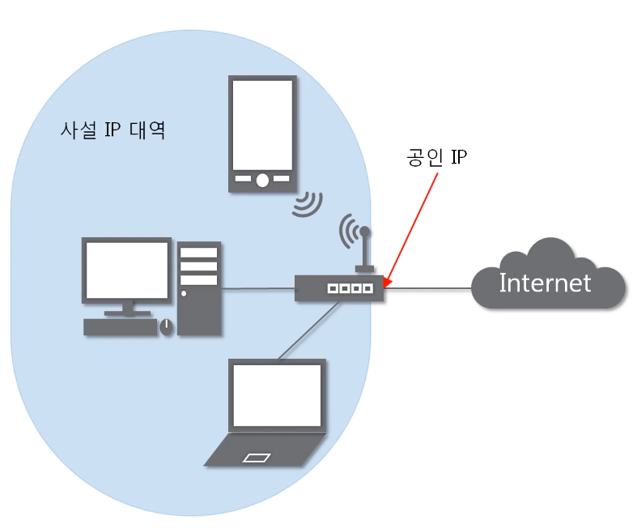
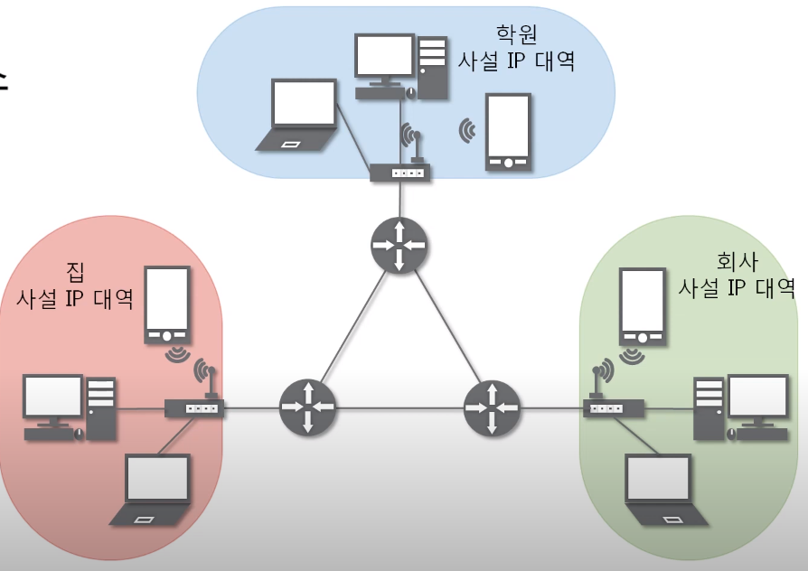
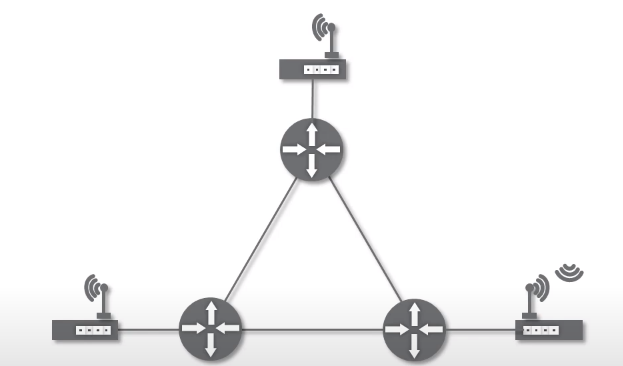
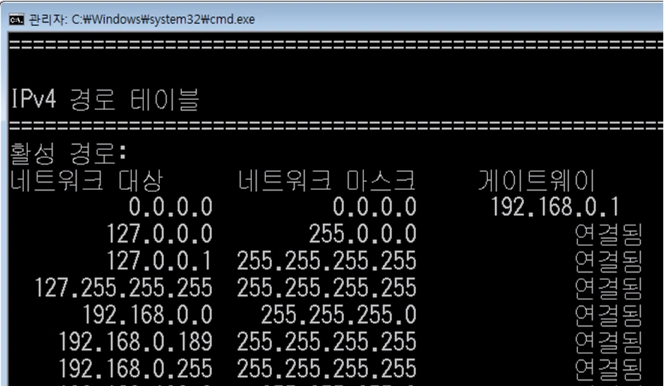
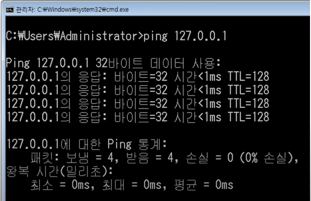
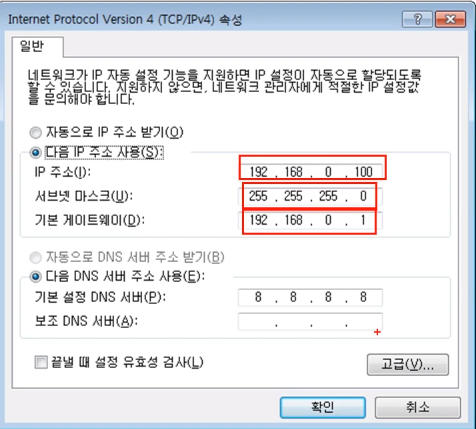

**목차**

- 3계층의 기능
- 일반적인 IP 주소
- 특수한 IP 주소

## 1. 3계층의 기능

**3계층에서 하는 일**

- 다른 네트워크 대역 즉, 멀리 떨어진 곳에 존재하는 네트워크까지 어떻게 데이터를 전달할 지 제어하는 일을 담당
- LAN과 LAN 연결
- router와 같은 3계층 장비 필요

**3계층에서 쓰는 주소**

- WAN에서 통신할 때 사용하는 IP 주소

- IPv4 주소: 현재 PC에 할당된 IP주소
- 서브넷 마스크: IP 주소에 대한 네트워크의 대역을 규정하는 것
- 게이트웨이 주소: 외부와 통신할 때 사용하는 네트워크의 출입구

**3계층 프로토콜**

- ARP 프로토콜: WAN에서 통신할 때 사용
- IPv4 프로토콜: WAN에서 통신할 때 사용
- ICMP 프로토콜: 서로가 통신되는지 확인할 때 사용

## 2. 일반적인 IP 주소

- 10진수 4바이트. 1바이트 = 8비트이므로 0~255까지 쓸 수 있음.

**Classful IP 주소**

- 낭비가 심함
- 초창기 방식

- A클래스
  - 첫번째 필드만 네트워크 구분 0. 0.0.0 ~ 127. 255.255.255
  - 나머지는 하나의 네트워크 대역 당 속해있는 컴퓨터 구분
  - 큰 기관 같은데서 쓰는 IP 주소
- B클래스
  - 두번째 필드까지는 네트워크 구분 128.0. 0.0 ~ 191.255. 255.255
- C클래스
  - 192.0.0. 0 ~ 191.255.255. 255 => 256대 정도
- D클래스
  - 멀티캐스트용
- E클래스
  - 실험용
- 클래스에 딱 맞게 쓰니까 낭비되는 IP주소가 많아 부족하게 됨 => 딱 안 맞게 쓰자

**Classfulless IP 주소**

- 점이 아닌 중간 지점에서 네트워크 대역 구분 00000|000.000000000.000000000.000000000
- 서브넷 마스크
  - 네트워크 대역을 나눠주는데 사용하는 값
  - 2진수로 표기했을 때 1로 시작, 1과 1사이에는 0이 올 수 없다는 규칙을 가지고 있다.
    - 255.255.255.192 => 11111111.11111111.11111111.11000000
    - 1인 부분: 네트워크 대역 / 0인 부분: 속한 컴퓨터

- 20대 쓰고 싶으면 32대 쓸 수 있게 하는게 최선이었음 => IP부족 => IPv6로 넘어가자. 16바이트 => 바뀌기 어려움

**사설 IP와 공인 IP**

- 공인 IP: 인터넷 세상. 네트워크 통신망이랑 통신할 때 사용하는 IP 주소
- 사설 IP: 같은 네트워크 대역에서 사용하는 IP 주소
- 공인 IP 1개당 2^32개의 사설 IP
- NAT(Network Adapter): 특정 IP를 특정 IP로 바꾸는 기술. 나갈 때 공인 IP로 나가게. 나갈 때 기록.

> 실제와 보이는 모습

- 실제 인터넷 세상에서는 공인 IP로만 통신
  - 외부 네트워크 대역에서는 사설IP 대역이 보이지 않는다.

- 사설 IP는 외부에서 보이지 않음
  - 나갔다가 들어오는 것만 통신됨
  - 바깥에서 내부로 들어올 수는 없음 => 포트 포워딩이라는 설정해줘야 가능
  - 웹 서버는 보통 공인 IP로 함

## 3. 특수한 IP 주소

**0.0.0.0/0**

- Wildcard
- 나머지 모든 IP
- 일반적이지 않음

**127.0.0.1**

- 나 자신을 나타내는 주소
- 네트워크 진단 시 씀

**게이트웨이 주소**

- 어딘가로 가려면 일단 여기로
- 외부 세상으로 나가는 문
- 일반적으로 이 네트워크 대역에서 쓸 수 있는 IP 중 가장 작은 IP 씀
- DNS 서버는 인터넷을 IP주소가 아닌 도메인 주소로 실행하기 위한 값