**목차**

- ARP 프로토콜
- ARP 프로토콜의 통신 과정
- ARP 테이블

# 1. ARP 프로토콜

**ARP가 하는 일**

- 같은 네트워크 대역에서 통신을 하기 위해 필요한 MAC 주소를 IP 주소를 이용해서 알아오는 프로토콜
- 같은 네트워크 대역에서 통신을 한다 하더라도 데이터를 보내기 위해서는 7계층부터 캡슐화를 통해 데이터를 보내기 때문에 IP주소와 MAC 주소 모두 필요. 이 때, IP 주소만 알아도 ARP를 통해 통신 가능
- 보안상 중요함. ARP스푸핑(상대방의 ARP 테이블 속임)

**ARP 프로토콜의 구조**

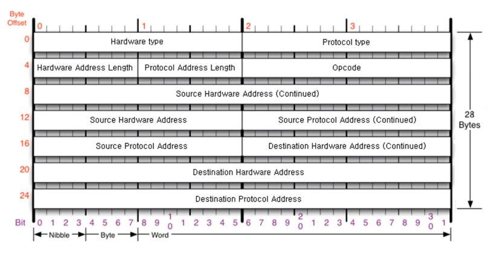

- Hardware type - 2계층에서 사용하는 프로토콜 타입
  - 0001(16진수): 이더넷. 깊게 공부하지 않는 이상 이더넷밖에 못봄
- Protocol type - 프로토콜 타입
  - 0800(16진수): IPV4
- Hardware Address Length
  - 06 - MAC 주소의 길이
- Protocol Address Length
  - 04 - IPV4 주소의 길이
- Opcode - Operation Code
  - 0001 - 로 작성해서 보내면(요청), 상대방이 0002 - 로 작성해서 보내줌(응답)

- Source Hardware Address(6byte) - 출발지 MAC 주소
- Source Protocol Address(4byte) - 출발지 IP 주소
- Destination Hardware Address(6byte) - 목적지 MAC 주소
- Destination Protocol Address(4byte) - 목적지 IP 주소

*이더넷 프로토콜만 목적지가 먼저 오고 나머지 프로토콜들은 출발지가 먼저 온다.

# 2. ARP 프로토콜의 통신 과정

- ARP 요청 프로토콜 만들어 보냄

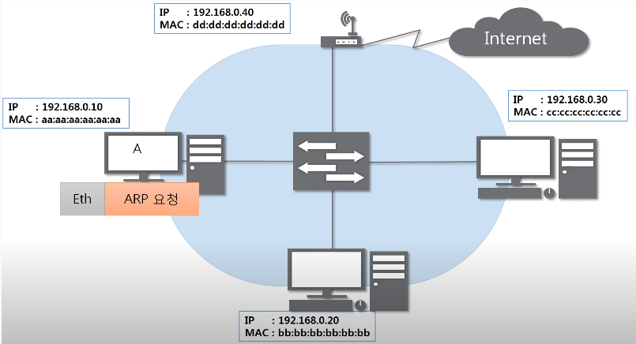

> ARP는 3계층이므로 2계층 붙여서 인캡슐레이션

- 목적지 MAC 주소 모르니까 00 00 00 00 00 00 으로 비워둠

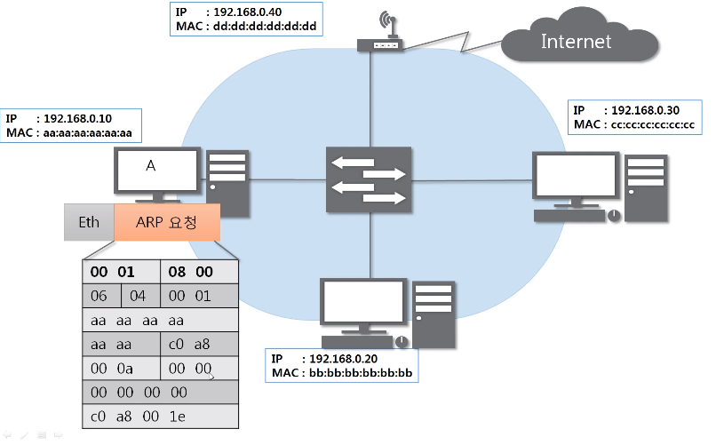

- 이더넷 프로토콜 인캡슐레이션

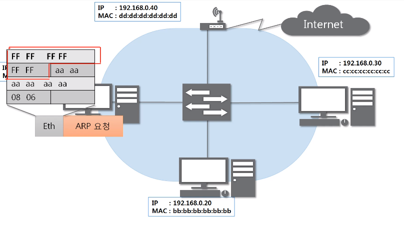

> FF FF FF FF FF FF FF 이진수로 1111111 Broadcast 방식. 모두에게 요청 보낸다. 

- 스위치(대표적인 2계층 장비) - 2계층 프로토콜까지만 확인. 2계층까지만 디캡슐레이션

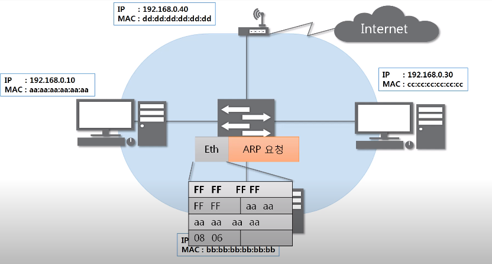

- 브로드캐스트라 같은 네트워크에 있는 모두에게 보내줌

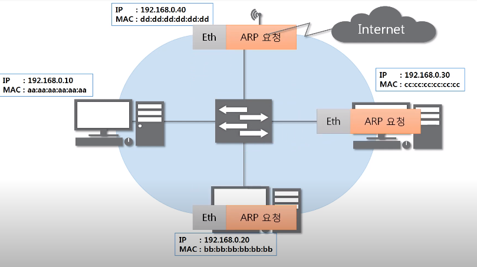

- 2계층 까봄

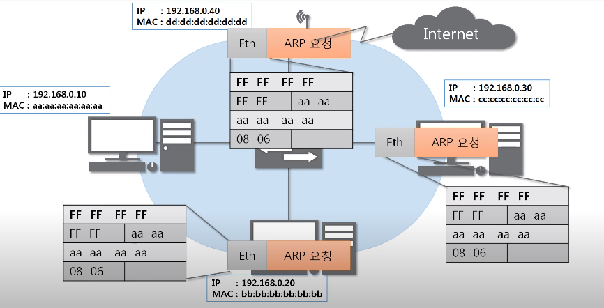

> 나한테 온 것 O

- 3계층도 까봄

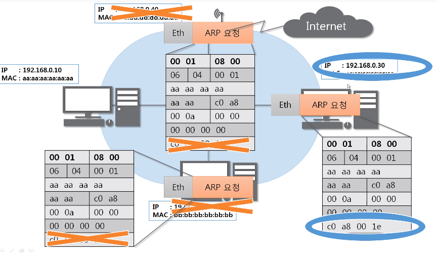

- 응답 프로토콜

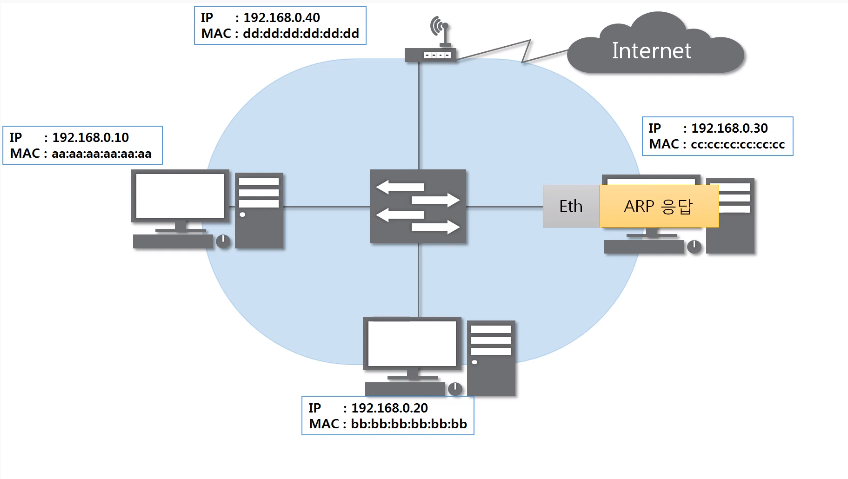

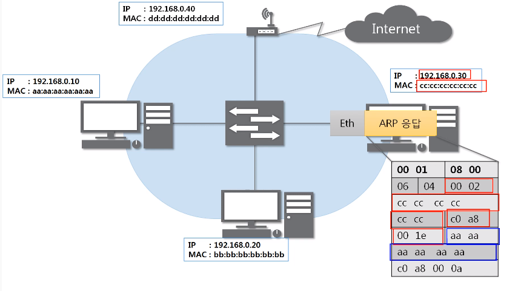

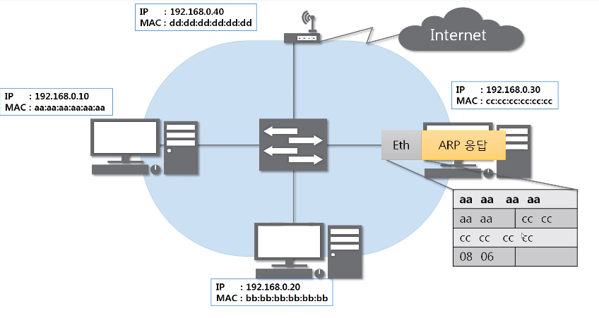

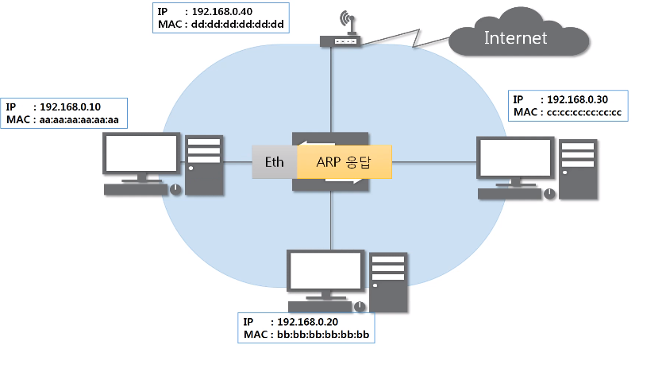

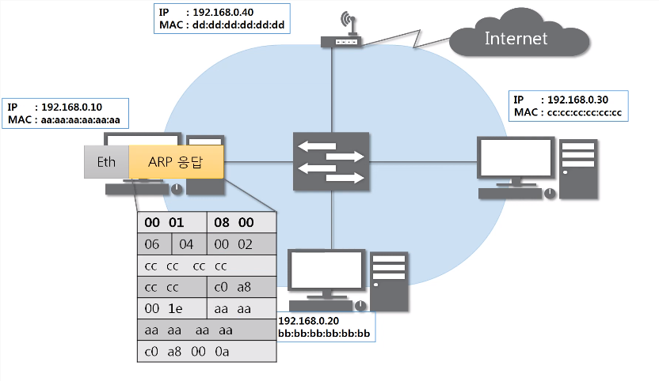

> 디캡슐레이션

- ARP 캐시 테이블에 등록

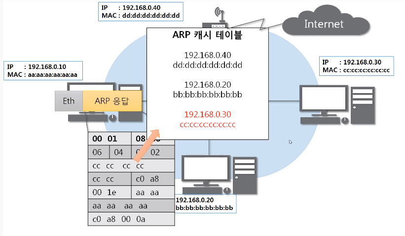

# 3. ARP 테이블

**나와 통신했던 컴퓨터들**

- 통신했던 컴퓨터들의 주소는 ARP 테이블에 남는다.

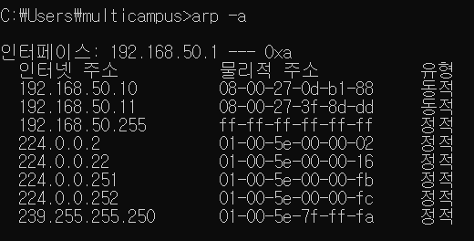

*캐시: 일정 시간이 지나면 없어진다고 보면 됨
