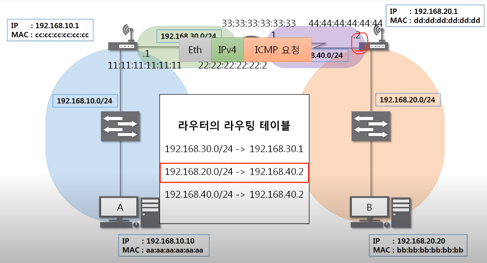

**목차**

- IPv4 프로토콜
- ICMP 프로토콜
- 라우팅 테이블
- 다른 네트워크와 통신 과정
- IPv4의 조각화

# IPv4 프로토콜

**Ipv4가 하는 일**

- 네트워크 상에서 데이터를 교환하기 위한 프로토콜
- 데이터가 정확하게 전달될 것을 보장하지 않는다
  - 단순히 멀리 있는 곳에 전달하는 역할만 한다
- 중복된 패킷을 전달하거나 패킷의 순서를 잘못 전달할 가능성도 있다
  - 악의적으로 이용되면 Dos 공격이 됨
- 데이터의 정확하고 순차적인 전달은 그보다 상위 프로토콜인 TCP에서 보장한다
  - 신뢰성 있는 통신은 4계층

**IPv4 프로토콜의 구조**

- Version: 4
- IHL(Header Length): 5 - 0101(20byte)
  - 원래 byte / 4
- TOS: 0 0
  - 옛날에만 씀. 주고 받는 데이터의 형식. 지금은 0
- Total Length: payload까지 합쳐진 전체 길이

조각화 세트

- Identification: 조각화할 때 원래 하나의 데이터였다는 것 알아보기 위해 주는 ID 값 
- IP Flags: x - 안쓰는것/ D - 데이터 안 쪼개고 보낼거다. 전송이 안됨. 거의 안 씀 / M - 나 말고 다른 패킷들이 더 있다고 알려주는 것. 최대 전송단위보다 크면 1, 아니면 0 (3bit)
- Fragment Offset: 시작부분으로부터 얼마만큼 떨어져 있다. 몇 번째 조각인지 알 수 있음

- Time To Live(TTL): 특정 숫자 적음. 3계층 장비 하나씩 넘어갈 때마다 1씩 줄음. 0이 되는 순간 네트워크 장비 버림. 패킷 죽은 것 처럼 됨
  - 응용: 상대방 컴퓨터 운영체제 알아볼 수 있다. 운영체제마다 설정하는 값 다름. Window 128, Linux 64
- Protocol: 상위 프로토콜이 무엇인지 알려줌. 
  - ICMP: 01
  - TCP: 06
  - UDP: 17
- Header Checksum: 이 헤더에 오류가 있는지 없는지 계산

- Source Address: 출발지 IP 주소
- Destination Address: 목적지 IP 주소

- 20byte 
  - IP Option 포함하면 최대60byte but, 보통 옵션 없이 씀

# ICMP 프로토콜

**ICMP가 하는 일**

- Internet Control Message Protocol
- 인터넷 상에서 제어 메시지를 주고 받는 프로토콜
- 상대방이랑 통신이 되나 안되나 확인
- 네트워크 컴퓨터 위에서 돌아가는 운영체제에서 오류 메시지를 전송 받는 데 주로 쓰인다
- 프로토콜 구조의 Type과 Code를 통해 오류 메시지를 전송 받는다

**ICMP 프로토콜의 구조**

- 특정 대상과 내가 통신이 잘 되는지 확인

- Type: 대분류
  - 8: 요청, 0: 응답
  - 3: 목적지까지 가지 못함 - 경로 상의 문제
  - 11: 목적지까지 갔는데 응답 못 받음 - 상대방의 문제. ex. 상대방이 방화벽 켜놔서 내 요청 못들음
  - 5: 옛날에 주로 씀. 원격지에 있는 상대방의 라우팅 테이블을 ICMP로 수정. 남의 것 수정 가능. 

- Code: 소분류
- Checksum: 헤더에 오류가 있나 없나 체크하기 위한 값. 알 필요 없음

# **라우팅 테이블**

- 3계층의 대표적 역할이 최적의 경로를 위의 프로토콜들로 찾아가는 것인데 이 경로를 지도처럼 저장해놓은것
  - 지도에 없으면 찾아갈 수 없음
  - 모르면 게이트웨이 통해 문 밖으로 나가라!
- 다른 네트워크 대역을 찾아가는 경로에 대한 지도

# **다른 네트워크와 통신 과정**

- A의 라우팅 테이블에 B의 네트워크 대역(192.168.20.0/24)이 있어야 통신 보낼 수 있음 

- 요청 프로토콜
  - 요청: 08

- IP 프로토콜

- 이더넷 프로토콜의 목적지 MAC 주소는? cc:cc:cc:cc:cc:cc
  - 이더넷은 가까운 곳에서 통신
  - 게이트웨이

- 스위치
  - 2계층만 확인
  - c로 보냄

- 2계층 까봄
  - 나한테 온 것 확인

- 3계층 까봄
  - 목적지 IP 주소가 내가 아님

- 라우팅 테이블 확인

- 이더넷 프로토콜 다시 작성

- 3계층 까봄
  - 목적지 MAC 주소 확인

- 자신의 라우팅 테이블 확인
  - 옆으로 가라 함

- 이더넷 프로토콜 다시 짜기
  - 즉, 이더넷 프로토콜은 네트워크 대역이 바뀔 때마다 새로 작성됨

- 보내기
  - 2, 3계층 까봄
  - 이더넷 프로토콜 다시 짜기

- B가 받음

- 응답

- 위와 같은 과정을 A까지 다시 보내줌

# **IPv4의 조각화**

**조각화란?**

- IPv4 프로토콜을 인캡슐레이션해서 데이터를 보낼 때, MTU(일반적으로 1500byte)가 설정되어 있는 네트워크 장비들을 통해서 내가 만든 패킷이 전달되어야 함. 내가 보내려는 데이터, 페이로드가 1500byte보다 크면 IPv4 프로토콜에서 데이터 조각화하여 전송
- 큰 IP 패킷들이 적은 MTU를 갖는 링크를 통하여 전송되려면 여러 개의 작은 패킷으로 쪼개어/조각화 되어 전송돼야 한다
- 목적지까지 패킷을 전달하는 과정에 통과하는 각 라우터마다 전송에 적합한 프레임으로 변환이 필요
- 조각화되면, 최종 목적지에 도달할 때까지 재조립되지 않는 것이 일반적
- IPv4에서는 발신지 뿐만 아니라 중간 라우터에서도 IP 조각화가 가능
  - IPv6에서는 IP 단편화가 발신지에서만 가능
- 재조립은 항상 최종 수신지에서만 가능

*MTU(Maximum Transmission Unit): 데이터의 최대 전송 단위

- MTU는 IPv4프로토콜(최대20byte)까지 포함. 따라서 Data 3280byte까지만 가능
- IP 프로토콜
  - MF: More Fragment, 내 뒤에 패킷 있다
  - Offset: 시작되는 위치. Data / 8

- 조각화 과정
  - 이더넷은 MTU 넘어가고 붙는다

