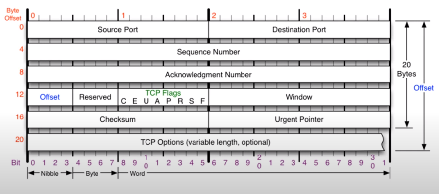
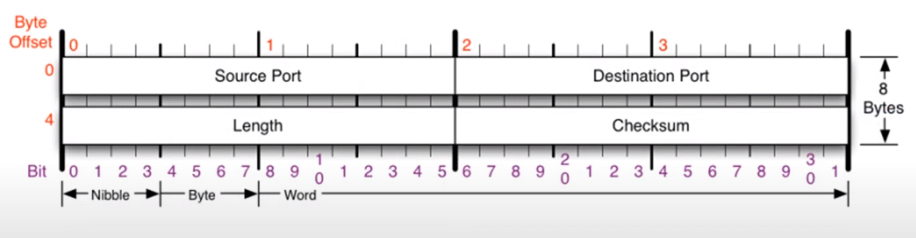
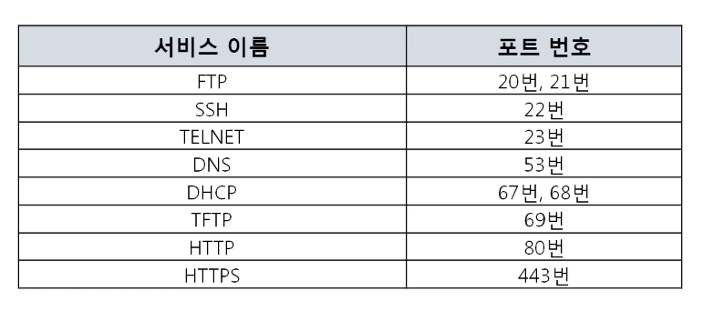
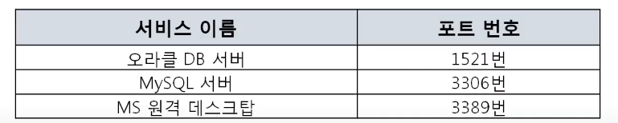
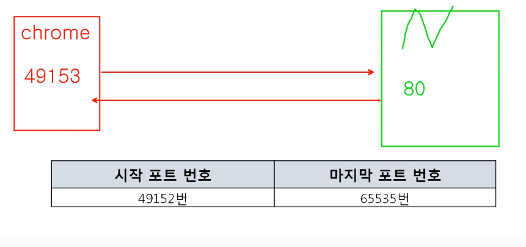
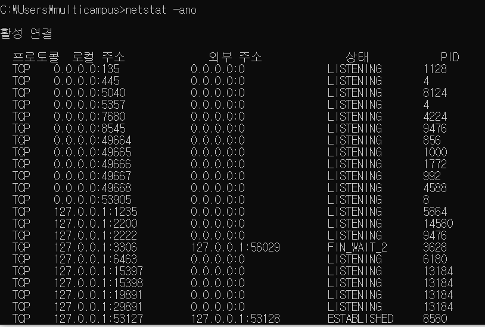

**목차**

- 4계층 프로토콜
- 포트 번호
- 프로그램의 연결 정보

# 4계층 프로토콜

**4계층에서 하는 일**

- 전송 계층(Transport layer)
- 송신자의 프로세스와 수신자의 프로세스를 연결하는 통신 서비스를 제공
- 연결 지향 데이터 스트림 지원, 신뢰성, 흐름 제어, 그리고 다중화와 같은 편리한 서비스 제공
- 연결 지향 전송 방식을 사용하는 전송 제어 프로토콜(TCP)
- 단순한 전송에 사용되는 사용자 데이터그램프로토콜(UDP)
- (맥주소로 상대방 네트워크 대역으로 상대방 컴퓨터 찾아가서) 그 컴퓨터에서 동작 중인 카톡 찾아주는 것
- 내 컴퓨터에서 동작하는 카톡과 상대 컴퓨터 카톡이 서로 쪽지 주고 받을 수 있게 해줌

*프로세스: 디스크에 저장되어 있던 프로그램이 메모리에서 동작 중인 프로그램

**TCP 프로토콜**

- 안전한 연결 지향하는 프로토콜

**UDP 프로토콜**

- 비연결지향형 프로토콜
  - 연결되든 말든 일단 데이터 던짐

# 포트 번호

**포트 번호의 특징**

- 포트 번호
  - 4계층에서 사용하는 주소
  - 내 컴퓨터에서 특정 프로그램이 사용하는 주소
  - 프로그램 하나 당 포트 번호 하나 사용 가능
- 특정 프로세스와 특정 프로세스가 통신을 하기 위해 사용한다
- 하나의 포트는 하나의 프로세스만 사용 가능하다
- 하나의 프로세스가 여러 개의 포트를 사용하는 것은 가능하다
- 포트 번호는 일반적으로 정해져 있지만 무조건 지켜야 하는 것은 아니다

**Well-known 포트**

- 이 정도는 알아야 함

**Registered 포트**

**Dynamic 포트**

- 일반 사용자들이 쓰는 서버
- 상대방 프로그램에 연결할 때 쓰는 내 서버

# 프로그램의 연결 정보

**나와 현재 연결되어 있는 컴퓨터들**

- 활성 연결 테이블
  - 현재 포트 활성 여부 나타냄

