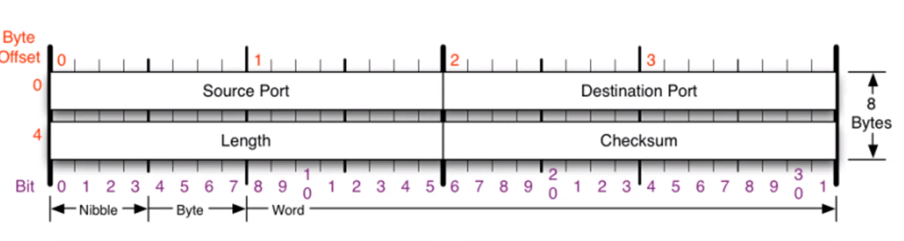
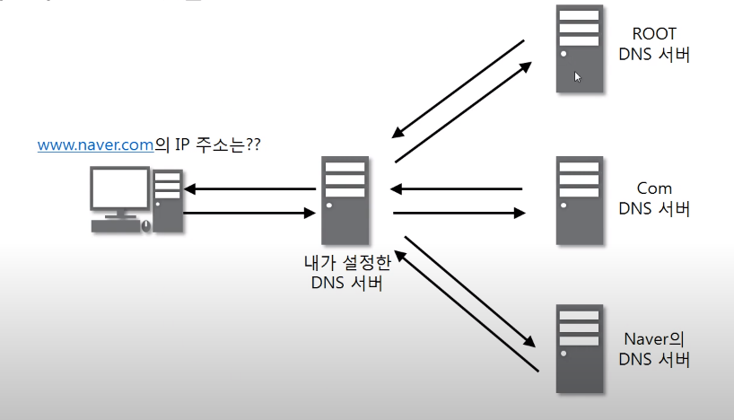
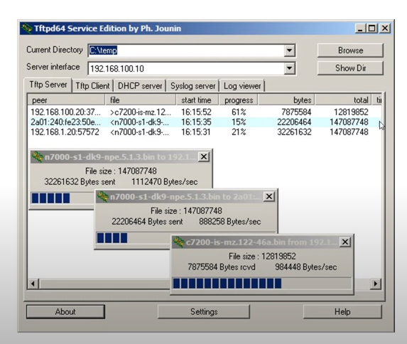
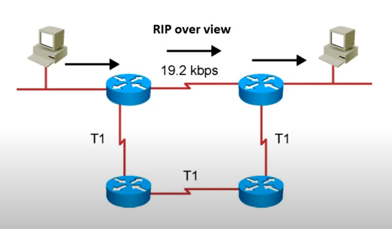

**목차**

- UDP 프로토콜
- UDP 프로토콜을 사용하는 프로그램

# UDP 프로토콜

**UDP가 하는 일**

- 사용자 데이터그램 프로토콜(User Datagram Protocol)
- 전송 방식이 너무 단순해서, 서비스의 신뢰성이 낮고, 데이터그램 도착 순서가 바뀌거나, 중복되거나, 심지어는 통보 없이 누락시키기도 한다.
- 일반적으로 오류의 검사와 수정이 필요 없는 프로그램에서 수행할 것으로 가정

# UDP 프로토콜을 사용하는 프로그램

**UDP 프로토콜을 사용하는 대표적인 프로그램들**

- DNS 서버
  - 도메인을 물으면 IP 알려준다

- tftp 서버
  - UDP로 파일 공유하는 파일 전송 프로그램

- RIP 프로토콜
  - 라우터들끼리 서로 라우팅 정보를 공유

