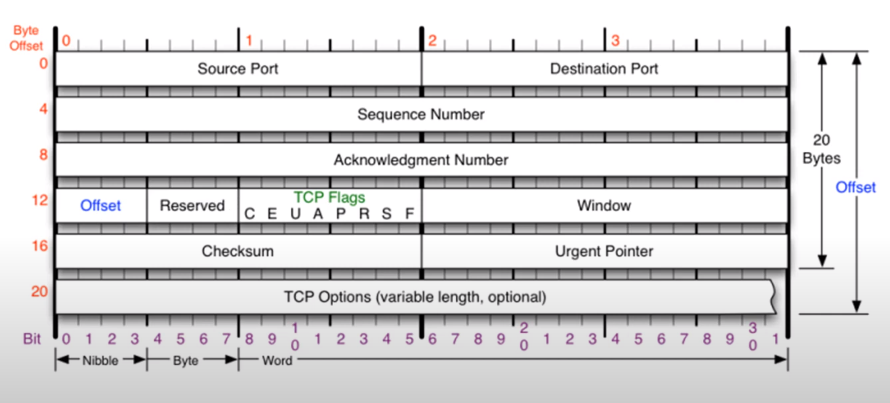
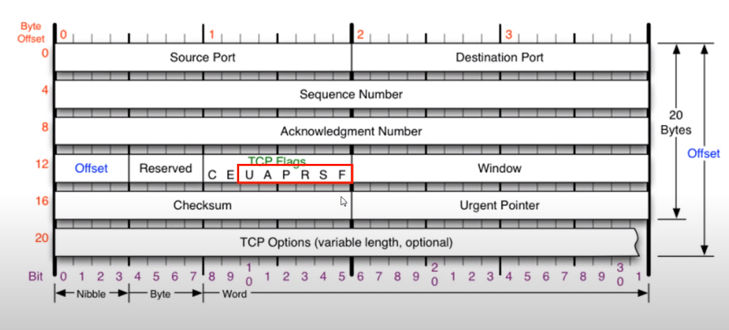
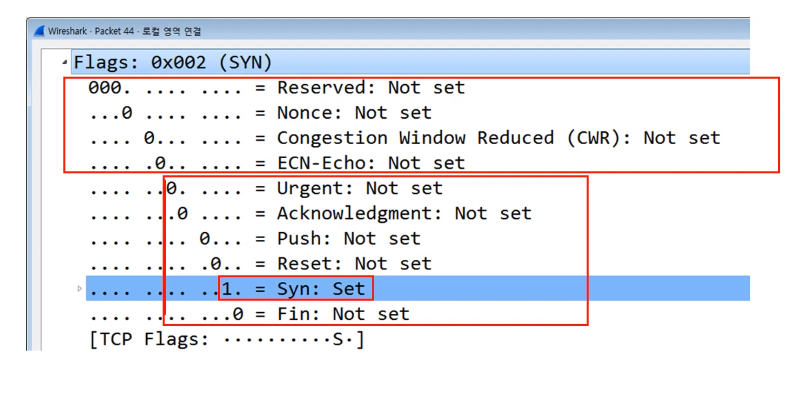
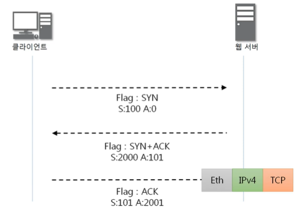
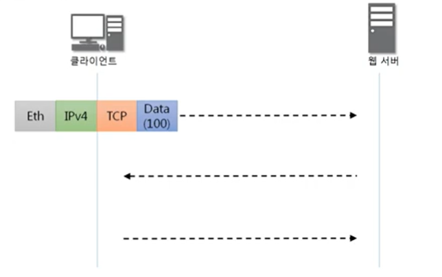
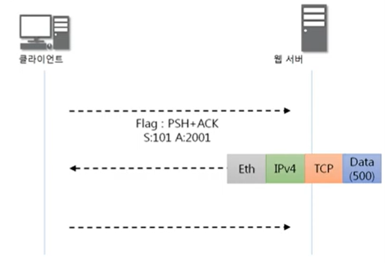

**목차**

- TCP 프로토콜
- TCP 플래그
- TCP를 이용한 통신과정
- TCP 상태전이도

# TCP 프로토콜

**TCP가 하는 일**

- 전송 제어 프로토콜(Transmission Control Protocol)
- 인터넷에 연결된 컴퓨터에서 실행되는 프로그램 간에 통신을 안정적으로, 순서대로, 에러없이 교환할 수 있게 한다
- TCP는 UDP보다 안전하지만 느리다
  - 체감은 불가능한 정도

- Offset: 헤더의 길이
- Reserverd: 예약된 필드로, 사용하지 않는 필드
- Window: 내 사용공간이 얼마만큼 남아있는지 알려주는 것
- TCP Options: 일반적으로는 20bytes, 최대 60bytes

# TCP 플래그

- 나 너한테 보내도 돼? ㅇㅇ 됨. ㄴㄴ 이따 보내
  - 이게 플래그
- 우아~프로스쀅스
- U(rgent): 1인 경우, 긴급 비트(우선순위 높은 데이터)
  - Urgent Pointer: 어디서부터가 긴급 데이터인지 알려주는 위치값
- A(CK): 승인 비트 
  - ㅇㅇ 보내도 돼
  - ㅇ/ㅇ 안돼~
- P(ush): 밀어넣기 비트
  - tcp 버퍼가 일정한 크기만큼 쌓여야 추가 전송하는데, 이거 상관 없이 데이터 밀어넣겠다
- R(eset): 초기화 비트
  - 문제 발생. 둘 사이 연결 관계 새로고침
- S(YN): 동기화 비트
  - 상대방이랑 연결을 시작할 때 무조건 사용하는 플래그
  - 얘가 처음 보내지고 나서부터 둘 사이 동기화됨. 서로 계속 연락
  - 가장 중요
- F(inish): 종료 비트
  - 연결 끊음

# TCP를 이용한 통신과정

**연결 수립 과정**

TCP를 이용한 데이터 통신을 할 때 프로세스와 프로세스를 연결하기 위해 가장 먼저 수행되는 과정

1. 클라이언트가 서버에게 요청 패킷을 보내고
2. 서버가 클라이언트의 요청을 받아들이는 패킷을 보내고
3. 클라이언트는 이를 최종적으로 수락하는 패킷을 보낸다

위의 3가지 과정이 **3Way Handshake** 이다.

*세션 하이재킹 : 공격자가 인증 작업 등의 완료된 정상적인 통신을 하고 있는 다른 사용자의 세션을 가로채서 별도의 인증 작업을 거치지 않고 가로챈 세션으로 통신을 계속하는 행위

-  TCP의 고유한 취약점을 이용하여 정상적인 접속을 빼앗는 방법
- 서버와 클라이언트에 각각 잘못된 시퀀스 넘버를 사용해서 연결된 세션에 잠시 혼란을 준 뒤 공격자가 끼어 들어가는 방식

**데이터 송수신 과정**

TCP를 이용한 데이터 통신을 할 때 단순히 TCP 패킷만을 캡슐화해서 통신하는 것이 아닌 페이로드를 포함한 패킷을 주고 받을 때의 일정한 규칙

1. 보낸 쪽에서 또 보낼 때는 SEQ번호와 ACK번호가 그대로다.
2. 받는 쪽에서 SEQ번호는 받은 ACK번호가 된다.
3. 받는 쪽에서 ACK번호는 받은 SEQ번호 + 데이터의 크기

