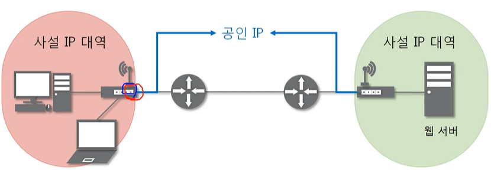
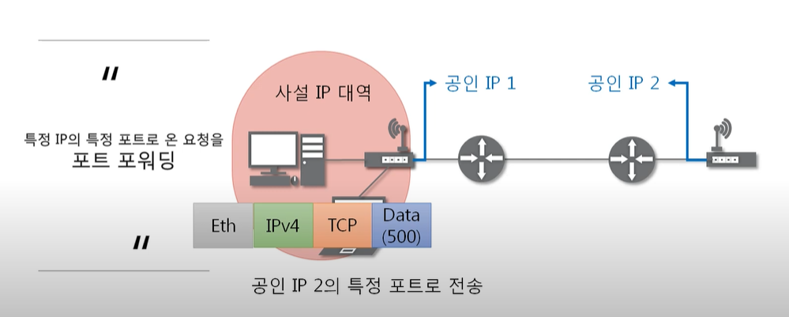
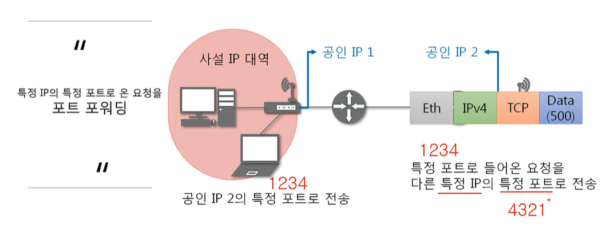
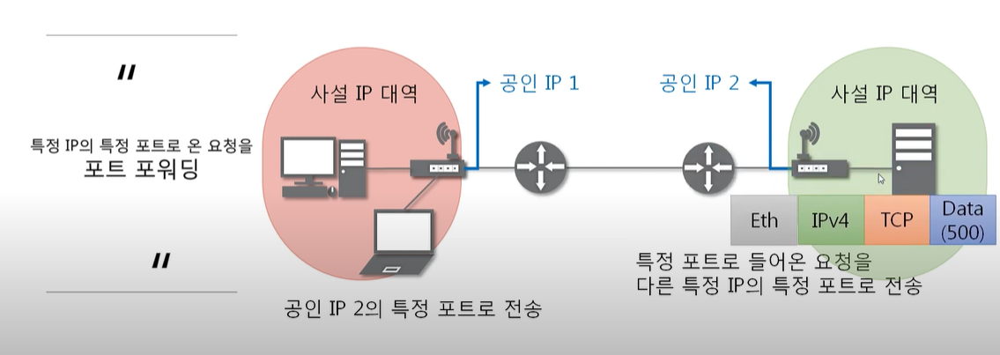

**목차**

- NAT
- 포트포워딩

# NAT

**NAT란?**

- Network Address Translation
- IP 패킷의 TCP/UDP 포트 번호와 소스 및 목적지의 IP 주소 등을 재기록하면서 라우터를 통해 네트워크 트래픽을 주고 받는 기술
- 특정 IP주소의 특정 포트번호로 가는 패킷을 다른 IP주소의 다른 포트 번호로 바꿔주는 것 
- 대개 사설 IP와 공인 IP의 주소를 바꾸는 곳에 사용

# 포트포워딩

**포트포워딩이란?**

- NAT의 응용 기술
- 특정 IP 주소와 포트 번호의 통신 요청을 특정 다른 IP와 포트 번호로 넘겨줌

- 공인 IP 2에 포트포워딩 설정을 해두어야 함

- 공유기가 대신 전달해줌

