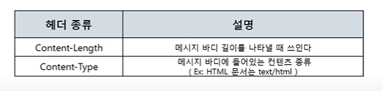

**목차**

- 들어가기 전에..
- HTTP 프로토콜
- HTTP 요청 프로토콜
- HTTP 응답 프로토콜
- HTTP 헤더 포맷

# 들어가기 전에..

나만의 7계층 프로토콜 만들 수 있다. 소켓 통신 프로그래밍 - 채팅 프로그램. 사실 소켓 통신은 채팅 프로그램을 하기 위한 프로그래밍이 아니다. 데이터 보내는 형식을 내가 만들면 그 형식이 하나의 프로토콜이 되는 것. 프로그램 만드는 사람 마음! 웹은 HTTP 프로토콜

# HTTP 프로토콜

**웹을 만드는 기술들**

- 웹 표준
- 클라이언트 사이드 스크립트: 클라이언트 컴퓨터에서 동작하는 코드들. 클라이언트가 조작 가능. 저장은 서버 쪽에 있다. 실행은 내 컴퓨터에서 되지만
- 프론트엔드
  - HTML : 웹 페이지를 채울 내용
  - Javascript : 웹 페이지에 들어갈 기능
  - CSS : 웹 페이지를 예쁘게 꾸밀 디자인

- 이거를 받아오는 프로토콜이 HTTP

  - HTTP : 웹 표준 데이터를 받아오는 애. 즉, HTML, JS, CSS 같은 파일을 웹 서버에게 요청하고 받아오는 프로토콜

- 서버 컴퓨터에서 동작하는 코드들. 클라이언트에서는 안 보임.

- 웹 서버 페이지를 만드는 기술들

- 백엔드

  - ASP/ASP.NET

  - JSP

  - PHP

 

**HTTP 프로토콜의 특징**

- HyperText Transfer Protocol : 하이퍼텍스트 전송 프로토콜
- www에 쓰이는 핵심 프로토콜로 문서의 전송을 위해 쓰이며, 오늘날 거의 모든 웹 애플리케이션에서 사용되고 있다.
  - 음성, 화상 등 여러 종류의 데이터를 MIME로 정의하여 전송 가능
- Request / Response 동작에 기반하여 서비스 제공

**HTTP 프로토콜의 통신 과정**

- 네트워크 부하가 심한 HTTP/1.0

- 1.0의 문제를 보완한 HTTP/1.1

# HTTP 요청 프로토콜

**HTTP 요청 프로토콜의 구조**

- 요청하는 방식을 정의하고 클라이언트의 정보를 담고 있는 요청 프로토콜 구조

- Request Line

  

  -  타입

  

- GET은 주소창에 데이터 보냄
- POST는 body에 데이터 보냄
  - 이것도 보일 수 있으니 HTTPS 써야 함

**URI**

- Uniform Resource Identifier

- 인터넷 상에서 특정 자원(파일)을 나타내는 유일한 주소

# HTTP 응답 프로토콜

**HTTP 응답 프로토콜의 구조**

# HTTP 헤더 포맷

**헤더 구조**

- 일반 헤더, 요청 헤더, 응답 헤더, 항목 헤더

- 일반 헤더

- 요청 헤더

- 응답 헤더

