### 구글과 나는 어떻게 연결되어 있는가

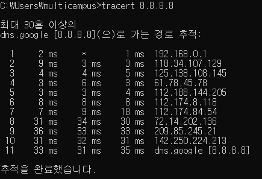

- **TRACERT(Trace Route)**: 지정된 호스트에 도달할 때까지 통과하는 경로의 정보와 각 경로에서의 지연 시간을 추적하는 네트워크 명령어
- 홉: 몇 개의 네트워크 대역을 넘어갔냐

- 보통 15개 안으로 전세계가 연결되어 있다 

- 192.168.0.1: iptime

### Wireshark 이용해서 프로토콜 캡쳐 후 직접 확인해보기

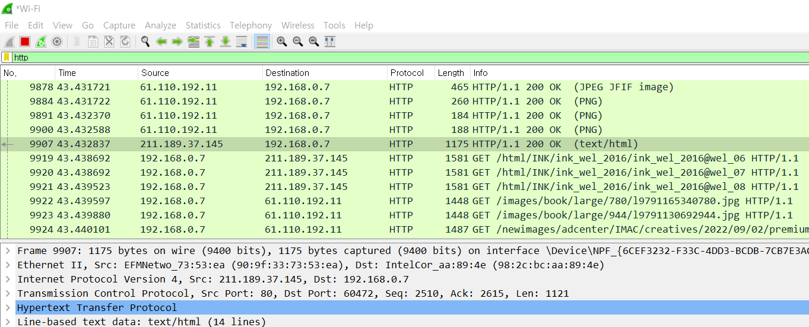

- HTTP: 전송할 데이터
- TCP: 네이버 프로그램(웹 서버 프로그램)이랑 내 프로그램(크롬-웹 브라우저) 서로 연결
  - 더블클릭해서 실행하는 것은 웬만하면 다 프로그램
- IPV4: 멀리 있는 것 연결
- Ethernet: 멀리 있는 거 찾음. 여러 개 중에 가까운 거 찾기

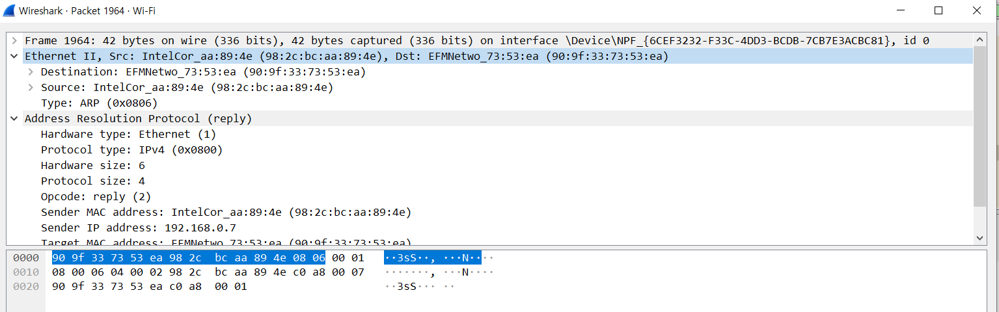

- 푸터 사용하는 애 단 하나: Ethernet

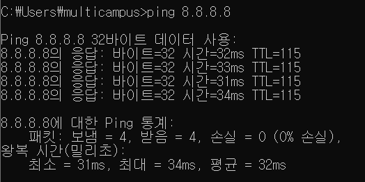

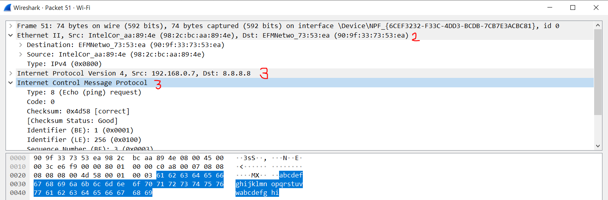

#### 내 PC의 MAC주소 확인해보기

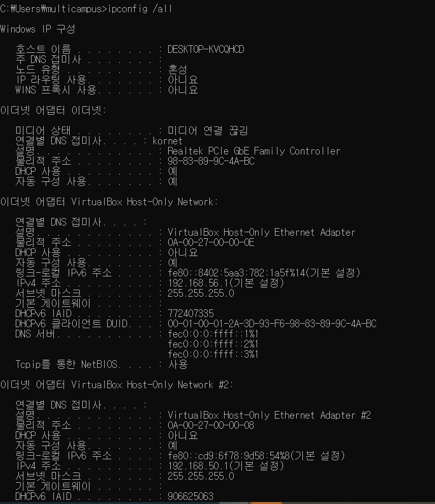

### Ethernet 프로토콜 캡쳐

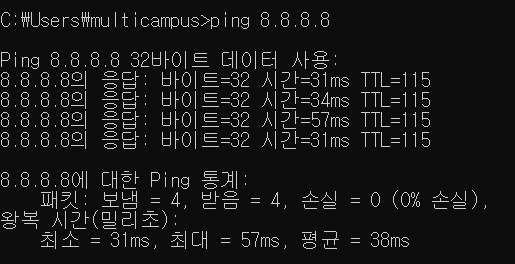

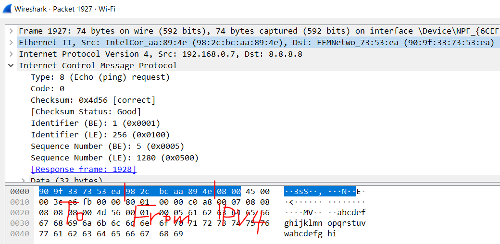

## ARP 캐시 테이블 조회

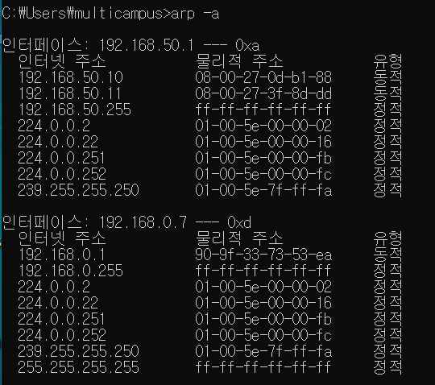

## ARP 프로토콜 분석

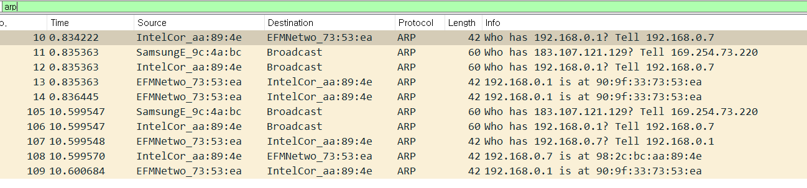

> 물음표 있으면 요청, 없으면 응답

- 요청

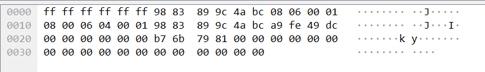

- 응답

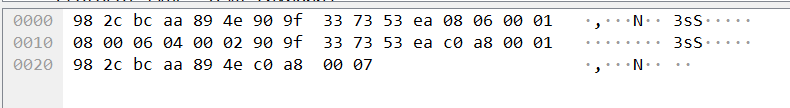
