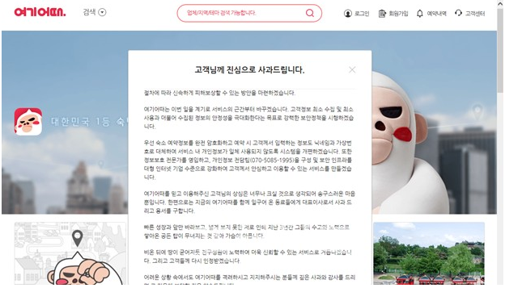

# SQL Injection

## 1. SQL Injection 이란?

- 악의적인 사용자가 보안상의 취약점을 이용하여, 임의의 SQL 문을 주입하고 실행되게 하여 데이터베이스가 비정상적인 동작을 하도록 조작하는 행위
- 가장 일반적인 웹 해킹 기술 중 하나
- 공격이 비교적 쉬운 편이고 공격에 성공할 경우 큰 피해를 입힐 수 있는 공격


## 2. 사례

**''여기어때'' 개인정보 99만건 유출**



- 해커들은 SQL Injection 공격으로 DB에 저장된 관리자 세션값(세션 아이디)을 탈취
- 탈취한 관리자 세션값으로 외부에 노출된 서비스 관리 웹페이지를 관리자 권한으로 우회 접속
- 예약 정보, 제휴점 정보 및 회원 정보를 유출
- 회사 측에 이메일을 보내 가상화폐 비트코인으로 수억 원대의 금전을 요구


## 3. 공격 방법

**보통 로그인 시**


```sql
SELECT NAME, HPNO FROM MEMBERS WHERE USERID = 'test' AND PASSWORD = 'test';
```


**공격**


```sql
SELECT NAME, HPNO FROM MEMBERS WHERE USERID = 1 AND PASSWORD = 1 or 1=1;
```

- WHERE절에서 AND 조건은 OR 조건보다 선행됨. 

```sql
SELECT NAME, HPNO FROM MEMBERS WHERE (USERID = 1 AND PASSWORD = 1) or 1=1;
```


## 4. 대응 방안

**Parameter Binding**

```java
String prepareStatementQuery = "SELECT * FROM MEMBERS WHERE userId = ? AND password = ?";
PrepareStatement prepareStatement = connection.prepareStatement(prepareStatemntQuery);
prepareStatement.setString(parameterIndex:1, loginName);
prepareStatement.setString(parameterIndex:2, loginPassword);
```

- PreparedStatement : Bind Variable을 사용한 쿼리
- Bind Variable : SQL 쿼리문에서 WHERE 절에 value 값을 ?로 사용하는 변수
- 위의 코드는 사용자 입력이 쿼리 구조를 방해하는 것을 방지해줌


참고

https://brightsec.com/blog/sql-injection-attack/

https://www.youtube.com/watch?v=qzas_-u4Nxk

https://noirstar.tistory.com/264

https://pinokio0702.tistory.com/54

https://qh5944.tistory.com/156

