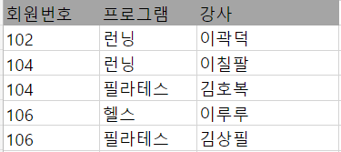
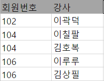
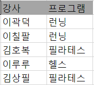

# 정규화 (Normalization)

## 1. 정규화란?

**목표**

: 테이블 간의 중복된 데이터를 허용하지 않는 것

정규화를 너무 잘 해놓으면 데이터를 가져올 때 조인이 많이 필요하게 되며, 정규화를 덜 할 경우 데이터의 중복이 늘어나게 된다. 다시 말해, 정규화를 수행하지 않으면 데이터의 중복이 많아져 하나의 트랜잭션에서 중복된 데이터를 모두 변경해야 하므로 성능이 떨어지게 되는 것이다.

## 2. 단계별 정규화 절차

### 1NF

> 수강등록현황 table

- 회원 몇 명이 프로그램을 추가해서 듣고자 한다.

- 위와 같이 입력할 경우
  - 단점1. 헬스 수강신청한 사람 찾기 어려워짐 => ~~`WHERE 프로그램 = '헬스'`~~ `WHERE 프로그램 LIKE '%헬스%'`
  - 단점2. 프로그램명 수정 어려워짐

###### 

**제1정규화**

> 수강등록현황 table

- 한 칸에 하나의 데이터만
- 릴레이션의 모든 속성 값이 원자값을 갖는 경우 ~~`(이다인,(요가,헬스))`~~    `(이다인,요가)` `(이다인,헬스)`

### 2NF

> 수강등록현황 table

- 위와 같이 입력할 경우
  - 헬스 가격을 7000으로 수정하려면??
  - 만약, 헬스 수강생이 10000명 이상일 경우, 컬럼 10000개 이상을 다 수정해야 함  

**제2정규화**

> 수강등록현황 table, 프로그램 table

- 현재 테이블의 주제와 관련 없는 컬럼을 다른 테이블로 빼는 작업
- 단점 
  - 김민정이 얼마 내야함?? 수강등록현황 table로만은 알 수 없음

*이론

**제2정규화** 

: partial dependency를 제거한 테이블

- partial dependency란? 

: composite primary key를 알아야 함

- composite primary key란?

  - 아래와 같은 table의 경우 pk(행을 서로 구분할 수 있는 컬럼)가 없음

  

  - 노란색 컬럼 둘을 합치면 pk 역할 가능

=> 합하면 pk인 컬럼들을 composite primary key 라고 한다.

- partial dependency란? 

: 하나의 composite primary key에 종속된 컬럼

ex. 프로그램 / 가격

**제2정규화** 

: partial dependency를 제거한 테이블

### 3NF

> 프로그램 table

- 제2정규형이다. composite primary key들 없음
- pk : 프로그램
- 출신대학 
  - pk랑 상관 없음
  - 강사에 종속

**제3정규화**

> 프로그램 table, 강사 table

- 일반 컬럼에만 종속된 컬럼은 다른 테이블로 빼기
- 장점 : 학벌세탁 시 한 번에 수정 가능
- 단점 : 런닝 강사의 출신대학 프로그램 table로만 찾을 수 없음

### BCNF

**BCNF**

: 제 3 정규화를 진행한 테이블에 대해 <u>모든 결정자가 후보키가 되도록</u> 테이블을 분해하는 것

> 수강신청현황 table

- 기본키 pk ( 회원번호, 프로그램 ) 이지만 
- 강사가 프로그램명을 결정 ~~`프로그램 => 강사`~~  `강사 => 프로그램`
- 강사가 프로그램명을 결정하는 결정자지만, 후보키가 아니다 => BCNF 필요

*후보키 : 릴레이션을 구성하는 속성들 중에서 튜플을 유일하게 식별하기 위해 사용하는 속성들의 부분집합, 즉 기본키로 사용할 수 있는 속성

**BCNF**

> 수강신청현황 table, 강사 table

## 3. 장, 단점

## 4. 관계형 데이터베이스

** 비관계형 데이터베이스, 관계형 데이터베이스

참고

https://www.youtube.com/watch?v=Y1FbowQRcmI

https://mangkyu.tistory.com/28