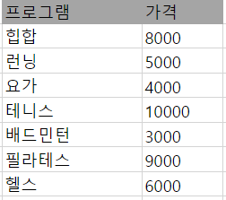
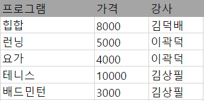

# 정규화 (Normalization)

## 1. 정규화란?

**목표**

: 테이블 간의 중복된 데이터를 허용하지 않는 것

- 정규화를 수행하지 않으면 데이터의 중복이 많아져 하나의 트랜잭션에서 중복된 데이터를 모두 변경해야 하므로 성능이 떨어지게 됨
- but, 정규화를 너무 잘 해놓으면 데이터를 가져올 때 조인이 많이 필요하게 됨


## 2. 단계별 정규화 절차

### 1NF

> 수강등록현황 table


- 회원 몇 명이 프로그램을 추가해서 듣고자 한다.


- 위와 같이 입력할 경우
  - 단점1. 헬스 수강신청한 사람 찾기 어려워짐 => ~~`WHERE 프로그램 = '헬스'`~~ `WHERE 프로그램 LIKE '%헬스%'`
  - 단점2. 프로그램명 수정 어려워짐


**제1정규화**

> 수강등록현황 table


- 한 칸에 하나의 데이터만
- 릴레이션의 모든 속성 값이 원자값을 갖는 경우 ~~`(이다인,(요가,헬스))`~~    `(이다인,요가)` `(이다인,헬스)`


**규칙**

```txt
- 각 컬럼이 하나의 속성만을 가져야 한다.
- 하나의 컬럼은 같은 종류나 타입(type)의 값을 가져야 한다.
- 각 컬럼이 유일한(unique) 이름을 가져야 한다.
- 칼럼의 순서가 상관없어야 한다.
```


### 2NF

> 수강등록현황 table


- 위와 같이 입력할 경우
  - 헬스 가격을 7000으로 수정하려면??
  - 만약, 헬스 수강생이 10000명 이상일 경우, 컬럼 10000개 이상을 다 수정해야 함  


**제2정규화**

> 수강등록현황 table, 프로그램 table



- 현재 테이블의 주제와 관련 없는 컬럼을 다른 테이블로 빼는 작업
- 단점 
  - 김민정이 얼마 내야함?? 수강등록현황 table로만은 알 수 없음 => 수강등록현황, 프로그램 table  둘 다 읽어야 함.


*이론

**제2정규화** 

: partial dependency를 제거한 테이블

- partial dependency란? 

: 하나의 composite primary key에 종속된 컬럼

: composite primary key를 알아야 함

- composite primary key란?

  - 아래와 같은 table의 경우 pk(행을 서로 구분할 수 있는 컬럼)가 없음

  

  - 노란색 컬럼 둘을 합치면 pk 역할 가능


=> 합하면 pk인 컬럼들을 composite primary key 라고 한다.


- partial dependency란? 

: 하나의 composite primary key에 종속된 컬럼

ex. 프로그램 / 가격


**제2정규화** 

: partial dependency를 제거한 테이블


**규칙**

```txt
- 제1정규형을 만족해야 한다.
- 모든 컬럼이 부분적 종속(Partial Dependency)이 없어야 한다. == 모든 칼럼이 완전 함수 종속을 만족해야 한다.
```


### 3NF

> 프로그램 table


- 제2정규형이다. composite primary key들 없음
- pk : 프로그램
- 출신대학 
  - pk랑 상관 없음
  - 강사에 종속


**제3정규화**

> 프로그램 table, 강사 table



- 일반 컬럼에만 종속된 컬럼은 다른 테이블로 빼기
- 장점 : 학벌세탁 시 한 번에 수정 가능
- 단점 : 런닝 강사의 출신대학 프로그램 table로만 찾을 수 없음
- 보통 관계형 데이터베이스( ex . MySQL )들은 제3정규화까지 한다. => 직접 구현해보시오.
  - 그 이상 정규화를 하면 정규화의 단점이 나타날 수도 있다.


**규칙**

```txt
- 제2정규형을 만족해야 한다.
- 기본키를 제외한 속성들 간의 이행 종속성(Transitive Dependency)이 없어야 한다.
```


### BCNF (Boyce-Codd Normal Form)

**BCNF**

: 제 3 정규화를 진행한 테이블에 대해 <u>**모든** 결정자가 후보키가 되도록</u> 테이블을 분해하는 것


> 수강신청현황 table


- 강사가 프로그램명을 결정 ~~`프로그램 => 강사`~~  `강사 => 프로그램`
  - ex) ~~런닝 => 이곽덕, 이칠팔~~  이곽덕 => 런닝, 이칠팔 => 런닝 

- 즉, 강사는 결정자
- 강사가 프로그램명을 결정하는 결정자지만, 후보키가 아니다 => BCNF 필요
  - 이곽덕이 2개라 기본키가 될 수 없음


*후보키 : 릴레이션을 구성하는 속성들 중에서 튜플을 유일하게 식별하기 위해 사용하는 속성들의 부분집합, 즉 <u>기본키로 사용할 수 있는 속성</u>


**BCNF**

> 수강신청현황 table, 강사 table


- 결정자인 강사가 pk가 됨


**규칙**

```txt
- 제3정규형을 만족해야 한다.
- 모든 결정자가 후보키 집합에 속해야 한다.
```


여기까지 기본 정규형

### 제4정규형

여기부터 고급 정규형

**제4정규화**

: 다치 종속이 없어야 한다. 

- 다치 종속이란?
  - 두 개의 독립된 attribute가 1:N 관계로 대응하는 관계 `회원 번호 ↠ 프로그램`


- 제1정규화


=> 불필요하게 회원번호와 회원이름이 중복됨

- 제4정규화


**규칙**

```txt
- BCNF를 만족해야 한다.
- 다치 종속(Multi-valued Dependency)이 없어야 한다.
```


### 제5정규형

- 제5정규화


**규칙**

```txt
- 제4정규형를 만족해야 한다.
- 조인 종속(Join dependency)이 없어야 한다.
- 조인 연산을 했을 때 손실이 없어야 한다.
```


## 3. 장, 단점

**장점**

- DB 변경 시 이상 현상 제거
- DB 구조 확장 시, 재 디자인 최소화
  - 새로운 데이터로 인한 추가 확장 시, 그 구조를 변경하지 않아도 되거나 일부만 변경해도 됨으로써, 최소한의 영향만을 미치게 됨


**단점**

- 릴레이션의 분해로 인해 릴레이션 간의 JOIN연산이 많아짐 => 응답시간이 느려질 수 있음
- 대표적으로 JOIN 연산을 많이 해야 하는 DB의 경우 반정규화 전략이 필요
  - ex ) 조회에 대한 처리 성능이 중요할 경우
  - 반드시 데이터 무결성을 보장할 수 있는 방법을 고려 후, 반정규화를 적용해야 함

*반정규화 : 되돌릴 반. 정규화됐던 것을 다시 되돌림. 테이블 중복, 컬럼 중복, 관계 중복


[참고]

https://www.youtube.com/watch?v=Y1FbowQRcmI

https://mangkyu.tistory.com/28

https://code-lab1.tistory.com/48

https://github.com/Youji-Sung/CS-study/blob/master/%EC%9C%A0%EC%A7%80/Key.md