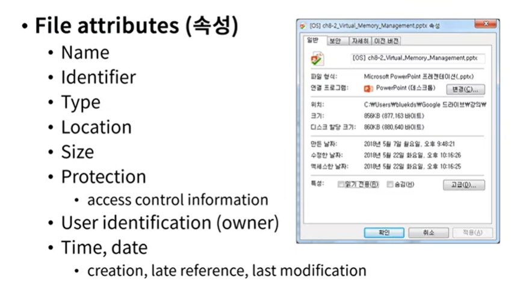
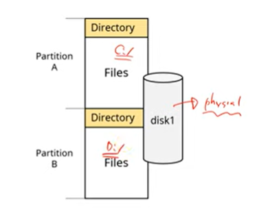
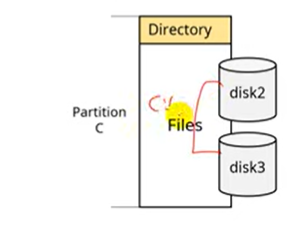

# 파일 시스템

사용자들이 사용하는 파일들을 관리하는 운영체제의 한 부분

**구성**

- File
- Directory structure : 파일 저장하는 곳
- Partitions : ex) 디스크, C드라이브

## File

- 보조 기억 장치(디스크)에 저장된 연관된 정보들의 집합
  - 보조 기억 장치 할당의 최소 단위
  - Sequence of bytes (물리적 정의)
- 내용에 따른 분류
  - Program file
  - Data file
- 형태에 따른 분류
  - Text file
  - Binary file

**속성**

**operations (연산)**

- Create
- Write
- Read
- Reposition
- Delete

=> OS는 file operation들에 대한 system call을 제공해야 함

**Access Methods**

- Sequential access
- Directed access
- Indexed access

## Directory

File들을 분류, 보관하기 위한 개념 ex) folder

**operations**

- Search for a file
- Create a file
- Delete a file
- List a directory
- Rename a file
- Traverse(탐색) the file system

## Partitions

disk를 논리적으로 나누어 놓은 것 (Virtual disk)

