[강의 자료]

https://www.youtube.com/watch?v=EdTtGv9w2sA&list=PLBrGAFAIyf5rby7QylRc6JxU5lzQ9c4tN

**목차**

[1.Computer System Overview](#1.ComputerSystemOverview)

[2.OS Overview](#2.OSOverview)

[3.Process Management](#3.ProcessManagement)

[4.Thread Management](#4.ThreadManagement)

[5.Process Scheduling](#5.ProcessScheduling)

[6.Process Synchronization and Mutual Exclusion](#ProcessSynchronizationandMutualExclusion)

[7.Deadlock](#7.Deadlock)

[8.Memory Management](#8.Memorymanagement)

[9.Virtual Memory](#9.VirtualMemory)

[10.Virtual Memory Management](#10.VirtualMemoryManagement)

# 1.Computer System Overview

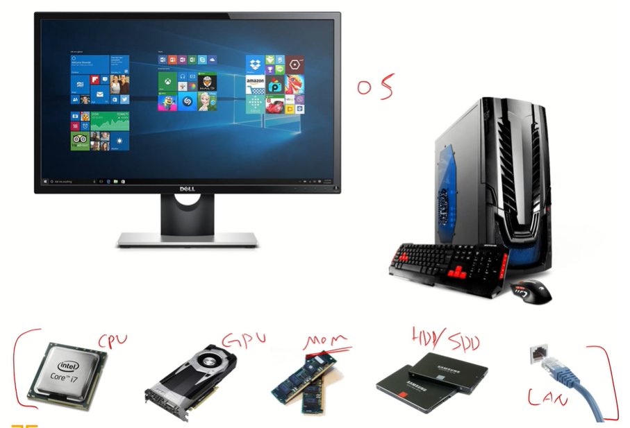

- 위의 녀석들을 효율적으로 활용할 수 있게 도와주는 OS

## **OS란?**

- 하드웨어(컴퓨팅 자원)들을 효율적으로 관리하는 녀석

- 사용자 또는 응용 프로그램들에게 서비스를 제공하는 역할

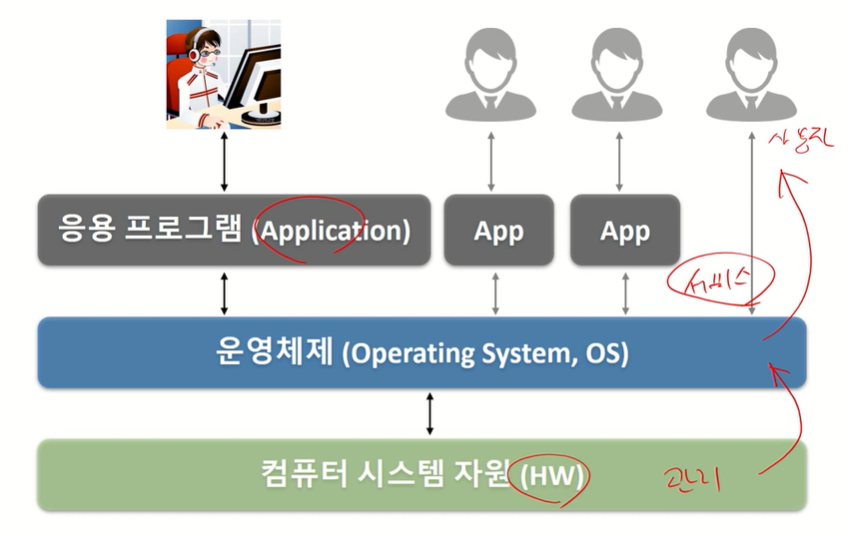

## **컴퓨터 하드웨어**

- 프로세서 (Processor) : 계산하는 녀석
  - CPU
  - 그래픽카드 (GPU)
  - 응용 전용 처리장치
- 메모리 (Memory) : 저장하는 녀석
  - ex) DRAM, Disk
  - 주 기억장치
  - 보조 기억장치
- 주변장치
  - 키보드/마우스 (입력장치)
  - 모니터/프린터 (출력장치)
  - 네트워크 모뎀 등 (네트워크 장치)

## **프로세서 (Processor)**

- 컴퓨터의 두뇌 (중앙처리장치)
  - 연산 수행
  - 컴퓨터의 모든 장치의 동작 제어

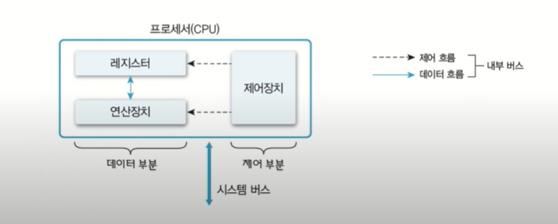

**레지스터 (Register)**

- 프로세서 내부에 있는 메모리
  - 프로세서가 사용할 데이터 저장
  - 컴퓨터에서 가장 빠른 메모리

- 레지스터의 종류
  - 용도에 따른 분류
    - 전용(정해진 용도) 레지스터, 범용 레지스터
  - 사용자가 정보 변경 가능 여부에 따른 분류
    - 사용자 가시(가능) 레지스터, 사용자 불가시(불가능) 레지스터
  - 저장하는 정보의 종류에 따른 분류
    - 데이터 레지스터, 주소 레지스터, 상태 레지스터
- 사용자 가시 레지스터
  - 데이터 레지스터
  - 주소 레지스터
- 사용자 불가시 레지스터
  - 프로그램 카운터(Program Counter) : 다음에 실행할 명령어의 주소를 보관하는 레지스터
  - 명령어 레지스터(Instruction Register) : 현재 실행하는 명령어를 보관하는 레지스터
  - 누산기(ACCumulator) : (계산할 때) 데이터를 일시적으로 저장하는 레지스터

**프로세서의 동작**

연산장치와 다양한 레지스터들을 통해서 연산이 이루어진다.

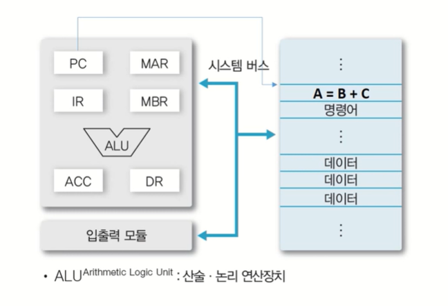

**운영체제와 프로세서**

- OS는 프로세서 관리하는 역할
- 프로세서에게 처리할 작업 할당 및 관리
  - 프로세스(Process) 생성 및 관리
  - 3장에서 배움
- 프로그램의 프로세서 사용 제어
  - 프로그램의 프로세서 사용 시간 관리
  - 복수 프로그램간 사용 시간 조율 등
  - 4,5장에서 배움

## 메모리 (Memory)

- 데이터를 저장하는 장치 (기억장치)
  - 프로그램 (OS, 사용자SW 등), 사용자 데이터 등
- 메모리의 종류

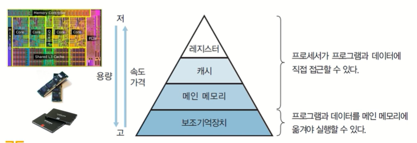

**메모리의 종류**

- 주기억장치 (Main Memory)
  - 프로세서가 수행할 프로그램과 데이터 저장
  - DRAM을 주로 사용, 요즘은 DDR4 많이 사용
    - 프로세서가 접근할 수 있는 것 중 용량이 가장 크고, 가격이 저렴
  - 디스크 입출력 병목현상(I/O bottleneck) 해소 : 아래의 Large Gap 해결!

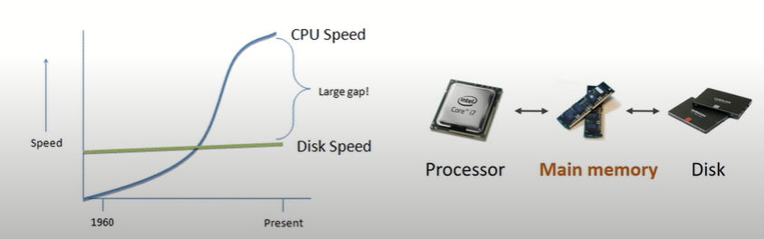

- 캐시 (Cache)
  - 프로세서 내부에 있는 메모리 (L1,L2 캐시 등)
    - 속도가 빠르고, 가격이 비쌈
  - 메인 메모리의 입출력 병목현상 해소 : 아래의 Performance Gap 해결!

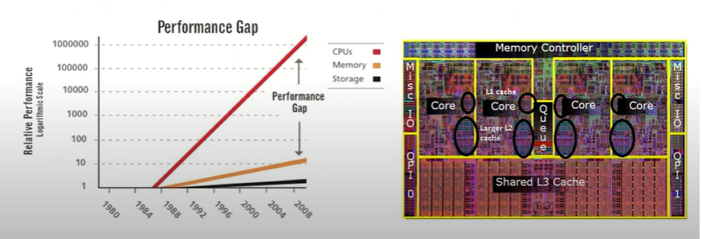

- 캐시의 동작
  - 일반적으로 HW적으로 관리 됨
  - 캐시 히트 (Cache hit) : 필요한 데이터 블록이 캐시 존재
  - 캐시 미스 (Cache miss) : 필요한 데이터 블록이 없는 경우

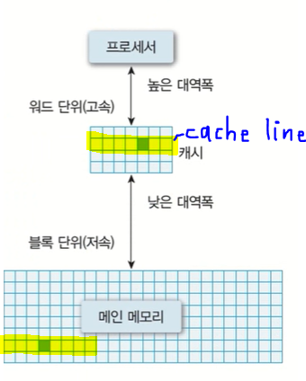

캐시 미스일 경우, 손해일 것 같은데?? 효과적인 이유는? 

=> Locality

***지역성 (Locality)**

- 공간적 지역성 (Spatial locality)
  - 참조한 주소와 인접한 주소를 참조하는 특성
- 시간적 지역성 (Temporal locality)
  - 한 번 참조한 주소를 곧 다시 참조하는 특성

=> 지역성은 캐시 적중률(cache hit ratio)과 밀접

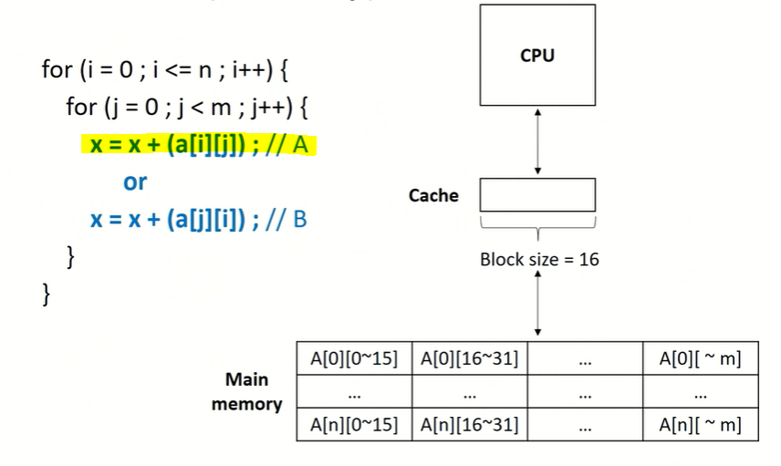

=> A로 짜는게 더 좋다.

- 보조기억 장치 (Auxiliary memory / secondary memory / storage)
  - 프로그램과 데이터를 저장
  - 프로세서가 직접 접근할 수 없음 (주변장치)
    - 주기억장치를 거쳐서 접근
    - 프로그램/데이터(20GB) > 주기억장치(8GB)인 경우는? 가상 메모리(Virtual memory)
  - 용량이 크고, 가격이 저렴

**메모리와 운영체제**

- 메모리 할당 및 관리
  - 프로그램의 요청에 따른 메모리 할당 및 회수
  - 할당된 메모리 관리
  - 7장에서 배움
- 가상 메모리 관리
  - 가상 메모리 생성 및 관리
  - 8장에서 배움

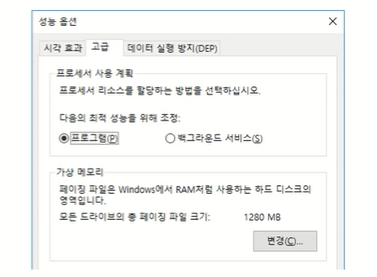

## 시스템 버스 (System Bus)

- 하드웨어들이 데이터 및 신호를 주고 받는 물리적인 통로

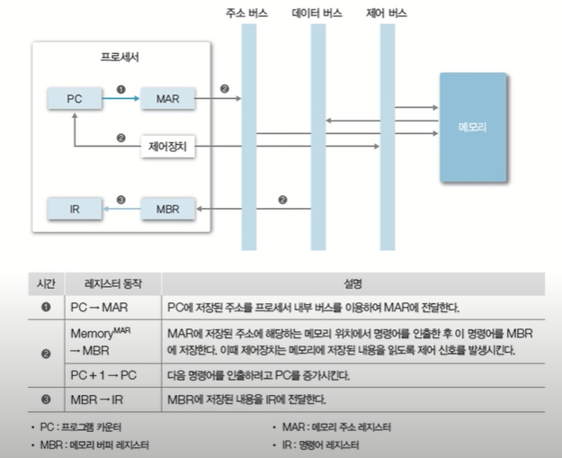