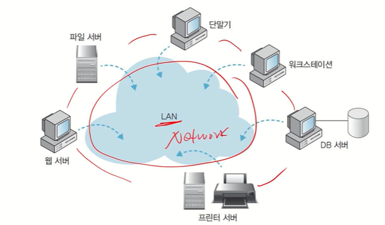
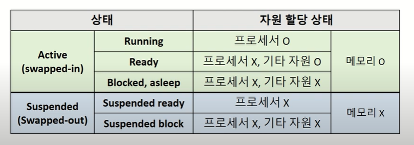
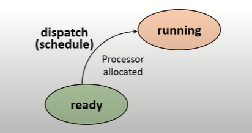

[강의 자료]

https://www.youtube.com/watch?v=EdTtGv9w2sA&list=PLBrGAFAIyf5rby7QylRc6JxU5lzQ9c4tN

**목차**

[1.Computer System Overview](#1Computer-System-Overview)

[2.OS Overview](#2OS-Overview)

[3.Process Management](#3Process-Management)

[4.Thread Management](#4Thread-Management)

[5.Process Scheduling](#5Process-Scheduling)

[6.Process Synchronization and Mutual Exclusion](#6Process-Synchronization-and-Mutual-Exclusion)

[7.Deadlock](#7Deadlock)

[8.Memory Management](#8Memory-management)

[9.Virtual Memory](#9Virtual-Memory)

[10.Virtual Memory Management](#10Virtual-Memory-Management)

# 1.Computer System Overview

- 위의 녀석들을 효율적으로 활용할 수 있게 도와주는 OS

## **OS란?**

- 하드웨어(컴퓨팅 자원)들을 효율적으로 관리하는 녀석

- 사용자 또는 응용 프로그램들에게 서비스를 제공하는 역할

## **컴퓨터 하드웨어**

- 프로세서 (Processor) : 계산하는 녀석
  - CPU
  - 그래픽카드 (GPU)
  - 응용 전용 처리장치
- 메모리 (Memory) : 저장하는 녀석
  - ex) DRAM, Disk
  - 주 기억장치
  - 보조 기억장치
- 주변장치
  - 키보드/마우스 (입력장치)
  - 모니터/프린터 (출력장치)
  - 네트워크 모뎀 등 (네트워크 장치)

## **프로세서 (Processor)**

- 컴퓨터의 두뇌 (중앙처리장치)
  - 연산 수행
  - 컴퓨터의 모든 장치의 동작 제어

**레지스터 (Register)**

- 프로세서 내부에 있는 메모리
  - 프로세서가 사용할 데이터 저장
  - 컴퓨터에서 가장 빠른 메모리

- 레지스터의 종류
  - 용도에 따른 분류
    - 전용(정해진 용도) 레지스터, 범용 레지스터
  - 사용자가 정보 변경 가능 여부에 따른 분류
    - 사용자 가시(가능) 레지스터, 사용자 불가시(불가능) 레지스터
  - 저장하는 정보의 종류에 따른 분류
    - 데이터 레지스터, 주소 레지스터, 상태 레지스터
- 사용자 가시 레지스터
  - 데이터 레지스터
  - 주소 레지스터
- 사용자 불가시 레지스터
  - 프로그램 카운터(Program Counter) : 다음에 실행할 명령어의 주소를 보관하는 레지스터
  - 명령어 레지스터(Instruction Register) : 현재 실행하는 명령어를 보관하는 레지스터
  - 누산기(ACCumulator) : (계산할 때) 데이터를 일시적으로 저장하는 레지스터

**프로세서의 동작**

연산장치와 다양한 레지스터들을 통해서 연산이 이루어진다.

**운영체제와 프로세서**

- OS는 프로세서 관리하는 역할
- 프로세서에게 처리할 작업 할당 및 관리
  - 프로세스(Process) 생성 및 관리
  - 3장에서 배움
- 프로그램의 프로세서 사용 제어
  - 프로그램의 프로세서 사용 시간 관리
  - 복수 프로그램간 사용 시간 조율 등
  - 4,5장에서 배움

## 메모리 (Memory)

- 데이터를 저장하는 장치 (기억장치)
  - 프로그램 (OS, 사용자SW 등), 사용자 데이터 등
- 메모리의 종류

**메모리의 종류**

- 주기억장치 (Main Memory)
  - 프로세서가 수행할 프로그램과 데이터 저장
  - DRAM을 주로 사용, 요즘은 DDR4 많이 사용
    - 프로세서가 접근할 수 있는 것 중 용량이 가장 크고, 가격이 저렴
  - 디스크 입출력 병목현상(I/O bottleneck) 해소 : 아래의 Large Gap 해결!

- 캐시 (Cache)
  - 프로세서 내부에 있는 메모리 (L1,L2 캐시 등)
    - 속도가 빠르고, 가격이 비쌈
  - 메인 메모리의 입출력 병목현상 해소 : 아래의 Performance Gap 해결!

- 캐시의 동작
  - 일반적으로 HW적으로 관리 됨
  - 캐시 히트 (Cache hit) : 필요한 데이터 블록이 캐시 존재
  - 캐시 미스 (Cache miss) : 필요한 데이터 블록이 없는 경우

캐시 미스일 경우, 손해일 것 같은데?? 효과적인 이유는? 

=> Locality

***지역성 (Locality)**

- 공간적 지역성 (Spatial locality)
  - 참조한 주소와 인접한 주소를 참조하는 특성
- 시간적 지역성 (Temporal locality)
  - 한 번 참조한 주소를 곧 다시 참조하는 특성

=> 지역성은 캐시 적중률(cache hit ratio)과 밀접

=> A로 짜는게 더 좋다.

- 보조기억 장치 (Auxiliary memory / secondary memory / storage)
  - 프로그램과 데이터를 저장
  - 프로세서가 직접 접근할 수 없음 (주변장치)
    - 주기억장치를 거쳐서 접근
    - 프로그램/데이터(20GB) > 주기억장치(8GB)인 경우는? 가상 메모리(Virtual memory)
  - 용량이 크고, 가격이 저렴

**메모리와 운영체제**

- 메모리 할당 및 관리
  - 프로그램의 요청에 따른 메모리 할당 및 회수
  - 할당된 메모리 관리
  - 7장에서 배움
- 가상 메모리 관리
  - 가상 메모리 생성 및 관리
  - 8장에서 배움

## 시스템 버스 (System Bus)

- 하드웨어들이 데이터 및 신호를 주고 받는 물리적인 통로

## 주변 장치

- 프로세서와 메모리를 제외한 하드웨어들
  - 입력장치 : 키보드, 마우스, 터치 인터페이스
  - 출력장치 : 모니터, 프린트, 스피커
  - 저장장치 : USB, CD

**주변장치와 운영체제**

- 장치드라이버 관리
  - 주변 장치 사용을 위한 인터페이스 제공
- 인터럽트(Interrupt) 처리
  - 주변 장치의 요청 처리
  - 3장에서 배움
- 파일 및 디스크 관리
  - 파일 생성 및 삭제
  - 디스크 공간 관리 등
  - 9,10장에서 배움

# 2.OS O**verview**

## 운영체제의 역할

- User Interface (편리성)
  - CUI (Character user Interface)
  - GUI (Graphical User Interface)
  - EUCI (End-User Comfortable Interface)
- Resource management (효율성)
  - HW resource (processor, memory, I/O devices, Etc.)
  - SW resource (file, application, message, signal, Etc.)
- Process and Thread management
- System management

## 컴퓨터 시스템의 구성

## 운영체제의 구분

**동시 사용자 수**

- Single-user system 
  - 한 명의 사용자가 모든 시스템 자원 독점
  - ex) Windows, Android 등
- Multi-user system 
  - 동시에 여러 사용자들이 시스템 사용
    - 각종 시스템 자원들에 대한 소유 권한 관리 필요
    - 기본적으로 Multi-tasking 기능 필요
  - 서버, 클러스터 장비 등에 사용
  - ex) Unix, Linux, Windows server 등

**동시 실행 프로세스 수**

- 단일작업 (Single-tasking system)
  - 시스템 내에 하나의 작업(프로세스)만 존재
    - 하나의 프로그램 실행 마친 뒤에 다른 프로그램 실행
  - 요즘은 찾아보기 힘듦
  - ex) MS-DOS
- 다중작업 (Multi-tasking system)
  - 동시에 여러 작업(프로세스)의 수행 가능
    - 작업들 사이의 동시 수행, 동기화 등을 관리해야 함
  - 운영체제의 기능 및 구조가 복잡
  - ex) Unix/Linux, Windows 등

## **작업 수행 방식**

**순차 처리 (No OS! ~1940s)**

- 운영체제 개념 존재하지 않음
  - 사용자가 기계어로 직접 프로그램 작성
  - 프로세서에는 명령어 저장 방법, 계산 대상, 결과 저장 위치와 방법, 출력 시점, 위치 등 전부!
- 실행하는 작업 별 순차 처리
  - 각각의 작업에 대한 준비 시간 소요 (사람마다 달랐을 것이기 때문) => Batch Systems 등장

**Batch Systems (1950s~1960s)**

- 모든 시스템을 중앙(전자계산소 등)에서 관리 및 운영
- 사용자의 요청 작업(천공카드 등)을 일정 시간 모아 두었다가 한번에 처리

- 시스템 지향적 (System-oriented)
- 장점
  - 많은 사용자가 시스템 자원 공유
  - 처리 효율(throughput) 향상
- 단점
  - 생산성(productivity) 저하
    - 같은 유형의 작업들이 모이기를 기다려야 함
  - 긴 응답시간(turnaround time)
    - 약 6시간(작업 제출에서 결과 출력까지의 시간)

**Time Sharing Systems (1960s~1970s)**

- 시분할 시스템

- 여러 사용자가 자원을 동시에 사용
  - OS가 파일 시스템 및 가상 메모리 관리
- 사용자 지향적(User-oriented)
  - 대화형(conversational, interactive) 시스템 - 반응이 있음
  - 단말기(CRT terminal) 사용

- 장점
  - 응답시간(response time) 단축 (약 5초)
  - 생산성(productivity) 향상
    - 프로세서 유휴 시간 감소
- 단점
  - 통신 비용 증가
    - 통신선 비용, 보안 문제 등
  - 개인 사용자 체감 속도 저하
    - 동시 사용자 수 늘어남 -> 시스템 부하 커짐 -> 느려짐(개인관점)

**Personal Computing**

- 개인이 시스템 전체 독점
- CPU 활용률(utilization)이 중요한 고려 대상이 아님
  - 내가 얼마나 편하게 시스템을 사용하는지가 더 중요 => 사용자 편리성
- OS가 상대적으로 단순함
- 장점
  - 빠른 응답시간
- 단점
  - 성능(performance)이 낮음

**Parallel Processing System**

- 병렬 처리 시스템
- 단일 시스템 내에서 둘 이상의 프로세서 사용
  - 동시에 둘 이상의 프로세스 지원
- 메모리 등의 자원 공유 (Tightly-coupled system)
- 사용 목적
  - 성능 향상
  - 신뢰성 향상 (하나가 고정 시 나머지가 정상 동작 가능)
- 프로세서 간 관계 및 역할 관리 필요

**Distributed Processing Systems**

- 분산 처리 시스템
- 네트워크를 기반으로 구축된 병렬처리 시스템 (Loosely-coupled system)

- 물리적인 분산, 통신망 이용한 상호 연결

- ex) Cluster system
- 장점
  - 자원 공유를 통한 높은 성능
  - 고신뢰성
- 단점
  - 구축 및 관리가 어려움

**Real-time Systems**

- 실시간 시스템
- 작업 처리에 제한 시간(deadline)을 갖는 시스템
  - 제한 시간 내에 서비스를 제공하는 것이 자원 활용 효율보다 중요
- 작업(task)의 종류
  - Hard real-time task
    - 발전소 제어, 무기 제어
  - Soft real-time task
    - 동영상 재생

## 운영체제의 구조

- 커널(Kernel)
  - 알맹이
  - OS의 핵심 부분 (메모리 상주)
    - 가장 빈번하게 사용되는 기능들 담당
    - 시스템 관리(processor, memory, Etc) 등
- 유틸리티(Utility)
  - 비상주 프로그램
  - UI등 서비스 프로그램

**단일 구조**

- 장점
  - 커널 내 모듈 간 직접 통신
  - 효율적 자원 관리 및 사용 - 빠르다
- 단점
  - 커널의 거대화
  - 유지보수가 어려움
  - 한 모듈의 문제가 전체 시스템에 영향

**계층 구조**

- 현재는 대부분 이 구조
- 장점
  - 모듈화
    - 계층 간 검증 및 수정 용의
  - 설계 및 구현의 단순화
- 단점
  - 단일구조 대비 성능 저하
    - 원하는 기능 수행을 위해 여러 계층을 거쳐야 함

**마이크로 커널 구조**

- 커널의 크기 최소화
  - 필수 기능만 포함
  - 기타 기능은 사용자 영역에서 수행

## 운영체제의 기능

- 프로세스(Process) 관리
- 프로세서(Processor) 관리
- 메모리(Memory) 관리
- 파일(File) 관리
- 입출력(I/O) 관리
- 보조 기억 장치 및 기타 주변장치 관리 등

**Process Management**

- 프로세스 (Process)
  - 커널에 등록된 실행 단위 (실행 중인 프로그램)
  - 사용자 요청 처리/ 프로그램의 수행 주체(entity)
- OS의 프로세스 관리 기능
  - 생성/삭제, 상태관리
  - 자원할당
  - 프로세스 간 통신 및 동기화(synchronization)
  - 교착상태(deadlock) 해결 - 여러 개 프로세스가 하나의 자원을 두고 싸울 때
- 프로세스 정보 관리

**Processor Management**

- 중앙 처리 장치 (CPU)
  - 프로그램을 실행하는 핵심 자원
- 프로세스 스케줄링
  - CPU를 누구한테 얼마만큼 줄 것인가
  - 시스템 내의 프로세스 처리 순서 결정
- 프로세서 할당 관리

**Memory Management**

- 주기억장치
  - ex) DRAM
  - 작업을 위한 프로그램 및 데이터를 올려 놓는 공간
- Multi-user, Multi-tasking 시스템
  - 프로세스에 대한 메모리 할당 및 회수
  - 메모리 여유 공간 관리
  - 각 프로세스의 할당 메모리 영역 접근 보호
- 메모리 할당 방법(scheme)
  - 전체 적재
  - 일부 적재 (virtual memory concept)

**File Management**

- 파일 : 논리적 데이터 저장 단위
- 사용자 및 시스템의 파일 관리

**I/O Management**

- 입출력 과정
  - OS를 반드시 거쳐야 함

**Others**

- Disk
- Networking
- Security and Protection system
- Command interpreter system
- System call interface

# 3.Process Management

## 프로세스 **(Process)**

**Job vs Process**

- Job (or Program)
  - 실행할 프로그램 + 데이터
  - 디스크에 저장되어 있는 상태
  - 컴퓨터 시스템에 실행 요청 전의 상태
- Process
  - Job이 시스템에 등록된 상태
  - 실행을 위해 시스템(커널)에 등록된 작업
    - 시스템 성능 향상을 위해 커널에 의해 관리됨

**프로세스 정의**

실행중인 프로그램

- 커널에 등록되고 커널의 관리 하에 있는 작업
- 각종 자원들을 요청하고 할당 받을 수 있는 개체
- 프로세스 관리 블록(PCB)을 할당 받은 개체
- 능동적인 개체(active entity)
  - 실행 중에 각종 자원을 요구, 할당, 반납하며 진행

## **자원 (Resource)**

커널의 관리 하에 프로세스에게 할당/반납 되는 수동적 개체 (passive entity)

- 자원의 분류
  - H/W resources
    - Processor, memory, disk, monitor, keyboard, Etc.
  - S/W resources
    - Message, signal, files, installed SWs, Etc.

## **Process Control Block (PCB)**

- OS가 프로세스 관리에 필요한 정보 저장
- 프로세스 생성 시, 생성됨

**PCB가 관리하는 정보**

- PID : Process Identification Number
  - 프로세스 고유 식별 번호
- 스케줄링 정보
  - 프로세스 우선순위 등과 같은 스케줄링 관련 정보들
- 프로세스 상태
  - 자원 할당, 요청 정보 등
- 메모리 관리 정보
  - Page table, segment table 등
- 입출력 상태 정보
  - 할당 받은 입출력 장치, 파일 등에 대한 정보 등
- 문맥 저장 영역 (context save area)
  - 프로세스의 레지스터 상태를 저장하는 공간 등
- 계정 정보
  - 자원 사용 시간 등을 관리

=> PCB 정보는 OS 별로 서로 다름

=> PCB 참조 및 갱신 속도는 OS의 성능을 결정 짓는 중요한 요소 중 하나

## 프로세스의 상태 (Process States)

프로세스 - 자원 간의 상호작용에 의해 결정

**Process State Transition Diagram**

**Created State**

- 작업(Job)을 커널에 등록
- PCB 할당 및 프로세스 생성
- 커널
  - 가용 메모리 공간 체크 및 프로세스 상태 전이
    - <u>Ready</u> or <u>Suspended ready</u>

**Ready State**

- 프로세서 외에 다른 모든 자원을 할당 받은 상태
  - 프로세서(CPU) 할당 대기 상태
  - 즉시 실행 가능 상태
    - 프로세스가 생성되고 메모리를 할당 받았다면 CPU만 있으면 실행 가능
- Dispatch (or Schedule)
  - Ready state -> running state

**Running State**

- 프로세서와 필요한 자원을 모두 할당 받은 상태
- 열심히 실행하는 상태
- Running 상태에서 벗어나는 2가지 경우
  - Preemption
    - Running state -> ready states
    - running 상태에서 프로세서를 뺏겨 다시 ready 상태로 쫓겨난 것
    - 프로세서 스케줄링 (e.g, time-out, priority changes)
  - Block/sleep
    - Running state -> asleep state
    - I/O 등 자원 할당 요청 (ex. 은행 갔는데 서류 안 가져옴. 집가서 가져와야 함 => I/O)

**Blocked/Asleep State**

- 프로세서 외에 다른 자원을 기다리는 상태
  - 자원 할당은 System call에 의해 이루어짐
- Wake-up
  - Asleep state -> ready state

**Suspended State**

*suspended : 지연된

- 메모리를 할당 받지 못한 상태
  - suspended ready state
- 메모리를 빼앗긴 상태
  - suspended blocked state
  - Memory image를 swap device에 보관
    - swap divice : 프로그램 정보 저장을 위한 특별한 파일 시스템
  - 커널 또는 사용자에 의해 발생
- Swap-out(suspended), Swap-in(resume)

**Terminated/Zombie State**

- 프로세스 수행이 끝난 상태
- 모든 자원 반납 후, 커널 내에 일부 PCB 정보만 남아 있는 상태
- 이후 프로세스 관리를 위해 정보 수집하기 위함
  - 다음에 비슷한 작업이 들어왔을 때 관리 용이

## 프로세스 관리를 위한 자료구조

- Ready Queue
- I/O Queue
- Device Queue

## 인터럽트 (Interrupt)

예상치 못한(Unexpected), 외부에서 발생한 이벤트(external events)

**인터럽트 종류**

- I/O interrupt
  - 마우스 클릭, 키보드 침
- Clock interrupt
  - CPU가 일 할 때의 Clock
- Console interrupt
- Program check interrupt
- Machine check interrupt
- Inter-process interrupt 
- System call interrupt

**인터럽트 처리 과정**

- 인터럽트 발생
- 프로세스 중단 => 커널 개입
- 인터럽트 처리 (interrupt handling)
  - 인터럽트 발생 장소, 원인 파악
  - 인터럽트 서비스 할 것인지 결정
  - 인터럽트 서비스 루틴 (interrupt service routine) 호출

## Context Switching (문맥 교환)

- Context 
  - 프로세스와 관련된 정보들의 집합
  - CPU register context => in CPU
  - Code & data, stack, PCB => in memory

- Context saving 
  - 현재 프로세스의 Register context 를 저장하는 작업
  - 인터럽트 등의 이유로 CPU를 뺏겨 CPU register context를 메모리에 저장하는 것
- Context restoring
  - Register context를 프로세스로 복구하는 작업
- Context switching =~ Process switching
  - Context saving + Context restoring
  - 실행 중인 프로세스의 context를 저장하고, 앞으로 실행할 프로세스의 context를 복구하는 일
  - 커널의 개입으로 이루어짐

**Context Switch Overhead**

- Context switching에 소요되는 비용은 OS마다 다름
- 불필요한 Context switching을 줄이는 것이 중요!

​	=> 스레드(thread) 사용

## 요약

- 프로세스의 개념
- 프로세스 상태 변화
- PCB
- 인터럽트
- Context switching

