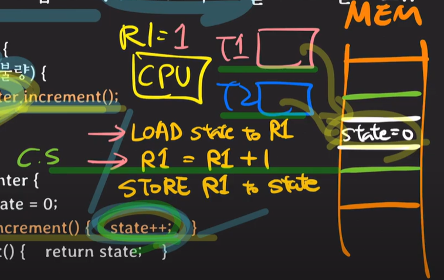
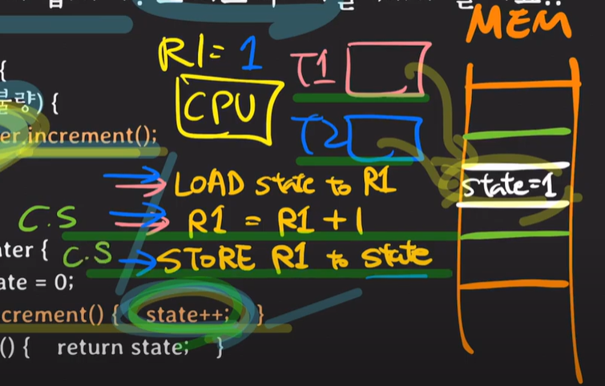
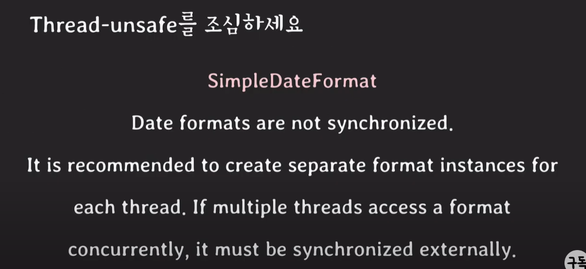

# 동기화(synchronization)

**동기화(synchronization)**

여러 프로세스/스레드를 동시에 실행해도 공유 데이터의 일관성을 유지하는 것

- 동기화가 왜 중요한지? 동기화를 하지 않으면 어떤 현상이 일어날 수 있는지 예제를 통해 알아보자.


## 예제 - 하나의 객체를 두 개의 스레드가 접근할 때

상한 귤을 골라내보자!

```java
for (귤 in 귤박스){
    if (귤 상태 is 불량){
        badCounter.increment(); // 여기서 두 개의 스레드가 badCounter 객체에 접근
    }
}

public class Counter {
    private int state = 0;
    public void increment() { state++; }
    public int get() { return state; }
}
```




- 쓰레드가 2개일 경우, 컨텍스트 스위칭이 일어나 state에 값이 제대로 저장이 안될 수 있다.
  - 경쟁 조건 일어난다.

**경쟁 조건(race condition)**

여러 프로세스/스레드가 동시에 같은 데이터를 조작할 때 타이밍이나 접근 순서에 따라 결과가 달라질 수 있는 상황


어떻게 동기화 시킬 것인가?

방법1. 아래 과정이 진행될 때 컨텍스트 스위칭이 일어나지 않게 한다. => 싱글 코어에서만 가능

```txt
LOAD state to R1
R1 = R1 + 1
STORE R1 to state
```

방법2. `increment()`메서드 실행할 때, 한 스레드에서만 실행하게!

**임계 영역(critical section)**

공유 데이터의 일관성을 보장하기 위해 하나의 프로세스/스레드만 진입해서 실행 가능한 영역

```java
do{
    entry section // critical section에 진입할 요건이 되는지 확인하는 영역
        critical section
    exit section
        remainder section
}while (TRUE)
```

critical section problem의 해결책이 되기 위한 조건

1. mutual exclusion (상호 배제) : 한 번에 하나의 프로세스 혹은 스레드만 critical section에서만 실행할 수 있음
2. progress (진행) : critical section이 비어있고, 들어가길 원한다면 그 중에 하나는 들어가야 한다 즉, 진행이 계속 되어야 한다
3. bounded waiting (한정된 대기) : 어떤 프로세스나 스레드가 무한정 critical section에 들어가지 못하면 안됨. 한정된 대기


*백엔드 멀티 쓰레드 환경에서 api 개발 시, 사용할 (자바)클래스가 Thread-safe 한지 항상 확인해야 한다!




[참고자료]

https://www.youtube.com/watch?v=vp0Gckz3z64&list=PLcXyemr8ZeoQOtSUjwaer0VMJSMfa-9G-&index=4