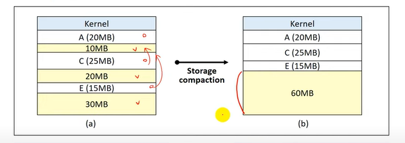

# 메모리

## 1. 배경

### 종류

메모리는 4가지 종류가 있다.

### **메모리 계층구조**

Block

- 보조기억장치와 주기억장치 사이의 데이터 전송 단위
- Size : 1~4KB

Word

- 주기억장치와 레지스터 사이의 데이터 전송 단위
- Size : 16~64bits

### **Address Binding**

: 프로그램의 논리 주소를 실제 메모리의 물리 주소로 매핑(mapping)하는 작업

##### 예시

`int a;` 

a => 100

##### Binding 시점에 따른 구분

- Compile time binding
  - 컴파일 할 때 바인딩
  - 프로세스가 메모리에 적재될 위치를 컴파일러가 알 수 있는 경우 => 위치가 변하지 않아야 함
  - 프로그램 전체가 메모리에 올라가야 함

- Load time binding 

  - 프로그램을 메모리로 올릴 때 바인딩
  - 메모리 적재 위치를 컴파일 시점에서 모르면, 대체 가능한 상대 주소를 생성
  - 적재 시점(load time)에 시작 주소를 반영하여 사용자 코드 상의 주소를 재설정 

  

  - 상대 주소로 다 미리 정해놨기 때문에 프로그램 전체가 메모리에 올라가야 함

- Run time binding
  - 실행 시간에 바인딩
  - 프로세스가 수행 도중 다른 메모리 위치로 이동할 수 있음 
  - HW의 도움이 필요 => MMU (Memory Management Unit)
  - 대부분의 OS가 사용

### Dynamic Loading

프로그램이 메모리에 연속되게 통으로 올라가는 경우 => 앞의 Address Binding

못 올라가는 경우, 필요한 프로그램만 메모리에 올리고 싶은 경우 => Dynamic Loading

- 모든 루틴(function)을 교체 가능한 형태로 디스크에 저장
- 실제 호출 전까지는 루틴을 적재하지 않음
  - 루틴의 호출 시점에 address binding 수행

- 장점 : 메모리 공간의 효율적 사용

### Swapping

- Swap-out

  : 프로세서 할당이 끝나고 수행 완료된 프로세스는 swap-device로 보낸다. 즉, 메모리의 이미지를 swap-device에 저장

- Swap-in

  : 새롭게 시작하는 프로세스는 메모리에 적재

## 2. Memory Allocation

### Continuous Memory Allocation (연속할당)

프로세스를 하나의 연속된 메모리 공간에 할당하는 정책

#### **메모리 구성 정책**

- 메모리에 동시에 올라갈 수 있는 프로세스 수
- 각 프로세스에게 할당되는 메모리 크기
- 메모리 분할 방법

#### **Uni-programming**

Multiprogramming degree = 1, 하나의 프로세스만 올라가는 경우

- 하나의 프로세스만 메모리 상에 존재
- 가장 간단한 메모리 관리 기법

- 단점
  - 메모리 낭비
  - Low system resource utilization
  - Low system performance

#### **Multi-programming**

##### Fixed(static) partition multi-programming (FPM) 

- 메모리 공간을 미리 고정된 크기로 분할
- 각 프로세스는 하나의 partition에 적재
- Partition 수 = K

- 단점 
  - 단편화

*단편화 (Fragmentation)

- Internal fragmentation : Partition 크기 > Process 크기
- External fragmentation : 남은 메모리 크기 > Process 크기지만, 들어갈 곳이 없음

##### Variable (dynamic) partition multi-programming (VPM)

- 초기에는 전체가 하나의 영역
- 프로세스를 처리하는 과정에서 메모리 공간이 동적으로 분할
- No Internal fragmentation

- 어디에 배치 할 것인가?

**배치 전략**

- First-fit (최초 적합)

  - 처음 만나는 방 중 충분한 크기를 가진 partition 선택

  

  - Low overhead
  - 공간 활용률이 떨어질 수 있음

  

- Best-fit (최적 적합)

  - Process가 들어갈 수 있는 partition 중 가장 작은 곳 선택

  

  - 탐색시간 오래 걸림 => overhead 크다
  - 크기가 큰 partition을 유지할 수 있음
  - 작은 크기의 partition이 많이 발생

- Worst-fit (최악 적합)

  - Process가 들어갈 수 있는 partition 중 가장 큰 곳 선택

  

  - 탐색시간이 오래 걸림
  - 작은 크기의 partition 발생을 줄일 수 있음
  - 큰 프로세스에게 필요한 큰 크기의 partition 확보가 어려움

- Next-fit (순차 최초 적합)

  

  - 최초 적합 전략과 유사
  - State table에서 마지막으로 탐색한 위치부터 탐색
  - 메모리 영역의 사용 빈도 균등화
  - Low overhead

- 어디에 배치할 것인가?

External fragmentation 이슈

해결법

- Coalescing holes (공간 통합)

  

  - 인접한 빈 영역을 하나의 partition으로 통합
  - Process가 memory를 release하고 나가면 수행 
  - 바로 옆이라, Low overhead

- Storage Compaction (메모리 압축)

  

  - 모든 빈 공간을 하나로 압축
  - High overhead
    - 모든 Process 재배치 (Process 중지)
    - 많은 시스템 자원을 소비

