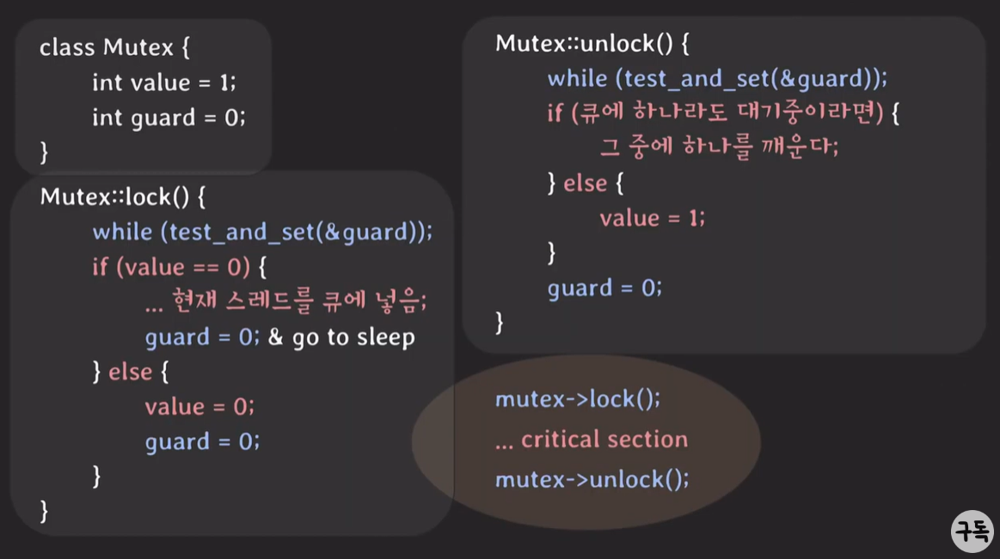
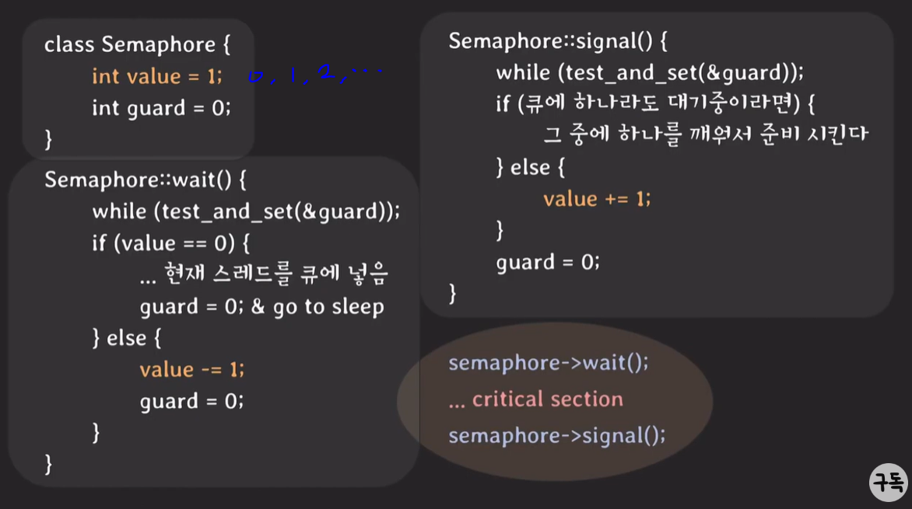

# 세마포어(Semaphore) & 뮤텍스(Mutex)

(복습)

**경쟁 조건(race condition)**

여러 프로세스/스레드가 동시에 같은 데이터를 조작할 때 타이밍이나 접근 순서에 따라 결과가 달라질 수 있는 상황

**동기화(synchronization)**

여러 프로세스/스레드를 동시에 실행해도 공유 데이터의 일관성을 유지하는 것

**임계 영역(critical section)**

공유 데이터의 일관성을 보장하기 위해 <u>하나의 프로세스/스레드만 진입</u>해서 실행 가능한 영역

*mutual exclusion : 하나의 프로세스/스레드만 진입


어떻게 mutual exclusion을 보장할 수 있을까? => 락(lock)을 사용하자!

```java
do {
    acquire lock
        critical section
    release lock
        remainder section
}
```


**방법1. 스핀락(spinlock)**

락을 가질 수 있을 때까지 반복해서 시도

```java
volatile int lock = 0;

void critical(){
    while (test_and_set(&lock) == 1);
    ... critical section
    lock = 0;
}

int TestAndSet(int* lockPtr) {
    int oldLock = *lockPtr;
    *lockPtr = 1;
    return oldLock;
}

// TestAndSet은 CPU atomic 명령어!
// - 실행 중간에 간섭받거나 중단되지 않는다.
// - 같은 메모리 영역에 대해 동시에 실행되지 않는다. -> 하나의 프로세스 or 스레드만 동기화시켜서 실행
```

단점 : 기다리는 동안 CPU를 낭비한다. 락을 확인하는데 계속 CPU 씀.

-> 방법2. 락이 준비되면 나 깨워


**방법2. 뮤텍스(Mutex)**

임계 구역을 가진 스레드들의 실행시간이 서로 겹치지 않고 각각 단독으로 실행되도록 하는 기술

- 동기화 대상이 하나
- 락을 가질 수 있을 때까지 휴식




**방법3. 세마포어(Semaphore)**

signal mechanism을 가진, 하나 이상의 프로세스/스레드가 critical section에 접근 가능하도록 하는 장치

- 동기화 대상이 하나 이상
- 순서 정할 수 있음




차이점

- 뮤텍스는 락을 가진 자만 락을 해제할 수 있지만 세마포어는 그렇지 않다
- 뮤텍스는 priority inheritance 속성(CPU 스케줄링)을 가진다. 세마포어는 그 속성이 없다. 


[참고자료]

https://www.youtube.com/watch?v=gTkvX2Awj6g&list=PLcXyemr8ZeoQOtSUjwaer0VMJSMfa-9G-&index=5

https://heeonii.tistory.com/14
