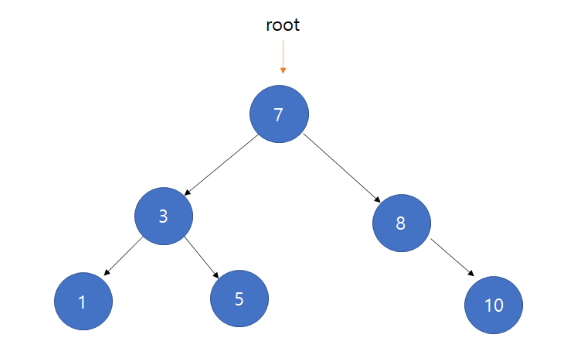
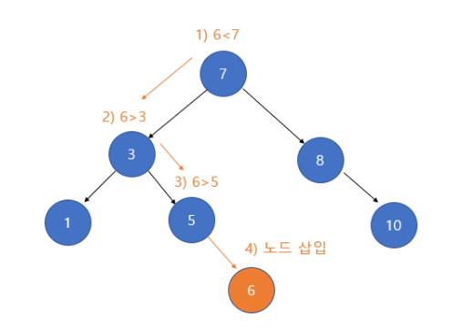
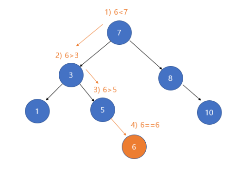
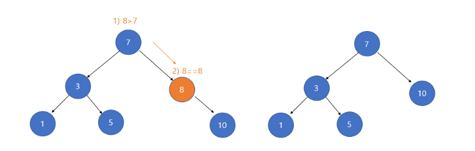
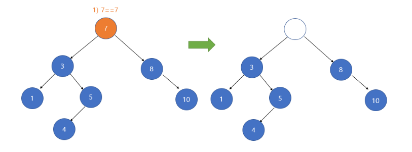
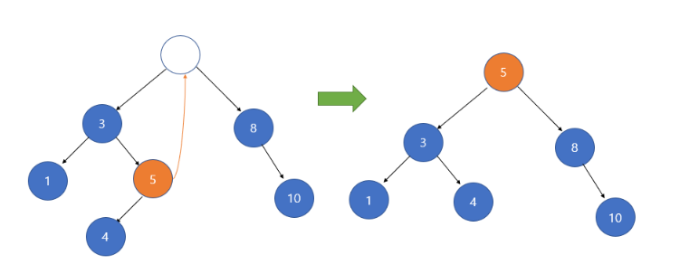

# 이진 탐색 트리 (Binary Search Tree)

## 1. 이진탐색트리란?

- 중복된 노드가 없어야 한다.
- 각 노드의 왼쪽 서브트리에는 해당 노드의 값보다 작은 값을 지닌 노드들로 이루어져 있다.
- 각 노드의 오른쪽 서브트리에는 해당 노드의 값보다 큰 값을 지닌 노드들로 이루어져 있다.
- 왼쪽 서브트리, 오른쪽 서브트리 또한 이진탐색트리이다.

## 2. 탐색 (Search)

- 부모노드가 왼쪽 자식노드보다 크거나 같고, 오른쪽 자식노드보다 작거나 같아서 효율적인 탐색 가능

10 : 7 - 8 - 10

4 : 7 - 3 - 5 - 없음

## 3. 삽입 (insert)

- 삽입할 값을 루트 노드와 비교해 같다면 오류 발생 (중복 값 허용 X)
- 삽입할 값이 루트 노드보다 작다면 왼쪽 서브 트리를 탐색해서 비어있다면 추가하고, 비어있지 않다면 다시 값을 비교
- 삽입할 값이 루트노드보다 크다면 오른쪽 서브트리를 탐색해서 비어있다면 추가하고, 비어있지 않다면 다시 값을 비교

## 4. 삭제 (delete)

- 삭제하려는 노드가 단말 노드(leaf node) 일 경우

=> 삭제할 노드의 부모 노드가 있다면 부모 노드의 자식 노드를 NULL로 만들고, 삭제할 노드 삭제

- 삭제하려는 노드의 서브 트리가 하나인 경우(왼쪽 혹은 오른쪽 서브 트리)

=> 삭제할 노드의 자식노드를 삭제할 노드의 부모노드가 가리키게 하고 해당 노드를 삭제

- 삭제하려는 노드의 서브트리가 두 개인 경우

1. 삭제할 노드 왼쪽 서브 트리의 가장 큰 자손을 해당 노드의 자리에 올린다.

2. 삭제할 노드 오른쪽 서브 트리의 가장 작은 자손을 해당 노드의 자리에 올린다. 

