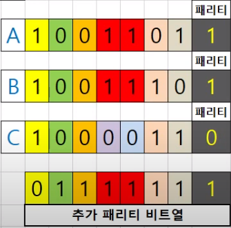

# 1. 패리티비트

**개념**


- 정보 전달 과정에서 오류가 생겼는지 검사하기 위해 추가하는 비트

- 송수신 과정에서 생기는 데이터의 오류를 검출하기 위한 일종의 장치 중 하나
- 주로 통신용으로 사용되는 아스키코드(7비트)에 1비트를 추가해서 사용됨
- 신뢰성 있는 통신을 위해서 데이터에 오류가 있는지 없는지를 확인하는 작업은 꼭 필요함
  - 디지털 데이터에서 정보를 저장하는 최소 단위를 비트(bit)라고 하고, 문자를 저장하는 최소의 단위는 8개의 비트가 모인 바이트(byte)라고 한다. (바이트의 경우 8개의 비트가 모여 총 256개의 정보 표현이 가능) 
  - 한편, 미국에서 데이터 통신으로 사용하는 문자로는 영문 알파벳 대문자 26개, 소문자 26개, 숫자 10개, 특수문자 32개, 공백문자 1개가 있고, 출력이 불가능한 제어문자로는 33개가 있다. 이 문자들을 모두 표시하기 위해서는 총 128개의 정보를 구분할 수 있어야 하므로 최소 7개의 비트(개)가 필요
  - 문자를 저장하는 최소 단위로 바이트를 사용하는 컴퓨터에서 미국에서 사용하는 모든 문자를 사용하면 한 개의 비트 공간이 남아 있게 된다. 사람들은 이 공간을 버리지 않고, 오류 여부를 확인하는 데 사용하였다. 이것이 ‘패리티 비트’


**예시**

1. 홀수 패리티 방식 : 해당 범위의 비트에 들어있는 1의 개수를 홀수로 만들어주는 패리티 비트


2. 짝수 패리티 방식 : 해당 범위의 비트에 들어있는 1의 개수를 짝수로 만들어주는 패리티 비트


- 오류 검출


- 오류 검출 불가


3. 병렬 패리티 방식

홀수 패리티


- 오류 검출


- 오류 검출 불가




# 2. 해밍 코드

**개념**

- 패리티 비트의 약점을 보완한 방법
  - 패리티 비트 여러 개를 추가해야 함
- 오류를 검출할 뿐만 아니라 오류의 위치를 발견하고 정정까지 가능

```txt
k => 패리티 비트 추가 개수
n => 데이터 비트 개수
패리티 비트 공식 => 2^k - k - 1 >= n
ex) 십진수 14 (이진수 1110)
    n = 4 => k = 3
```

```txt
패리티 비트 공식
해밍코드는 n개의 데이터어에 k개의 패리티 비트를 더하여 n+k비트의 새로운 코드어 생성
신드롬 값 C는 k개의 비트로 이루어지고 0에서 2^k - 1 사이의 2^k 개의 범위 가짐(비교원리)
0은 보통 오류 없음 나타냄
나머지 2^k - 1 값은 n + k 비트의 한 곳에서 오류가 있음을 나타냄
2^k - 1 >= n + k
2^k - k - 1 >= n
```


**예시**

홀수 패리티 방식

- 패리티는 2^x 자리에 삽입


ex) 14, 1110(2진수)


- 비교 원리


- 2^0


- 2^1


- 2^2


- 오류 검출


- 맞으면 0, 틀리면 1


참고

http://monthly.chosun.com/client/news/viw.asp?ctcd=&nNewsNumb=201704100070

https://www.youtube.com/watch?v=NtwMSk2vVIA

https://www.youtube.com/watch?v=CLy9O81SXlU

https://dreamlog.tistory.com/578